# Дипломный практикум в YandexCloud

---
## Цели:

1. Зарегистрировать доменное имя (любое на ваш выбор в любой доменной зоне).
2. Подготовить инфраструктуру с помощью Terraform на базе облачного провайдера YandexCloud.
3. Настроить внешний Reverse Proxy на основе Nginx и LetsEncrypt.
4. Настроить кластер MySQL.
5. Установить WordPress.
6. Развернуть Gitlab CE и Gitlab Runner.
7. Настроить CI/CD для автоматического развёртывания приложения.
8. Настроить мониторинг инфраструктуры с помощью стека: Prometheus, Alert Manager и Grafana.

---
## Этапы выполнения:

### Регистрация доменного имени

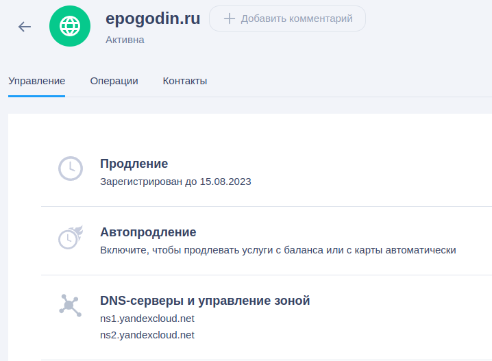

### Создание инфраструктуры

1. Создайте сервисный аккаунт

```
Создал руками
```

2. Подготовьте backend для Terraform:

```
Создал руками
```

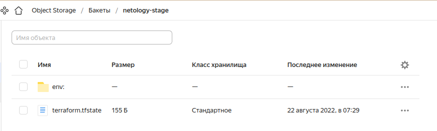

3. Настройте [workspaces](https://www.terraform.io/docs/language/state/workspaces.html)

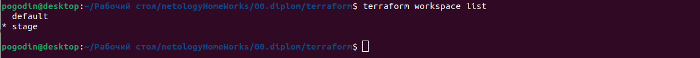

4. Создайте VPC с подсетями в разных зонах доступности.

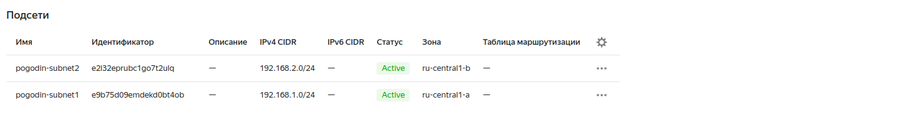

5. Убедитесь, что теперь вы можете выполнить команды `terraform destroy` и `terraform apply` без дополнительных ручных действий.

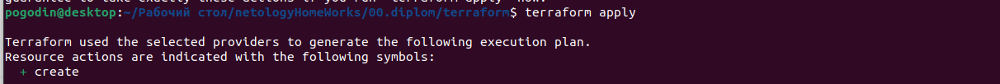

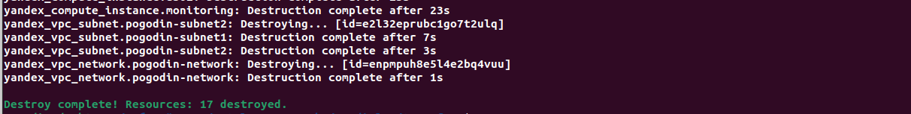

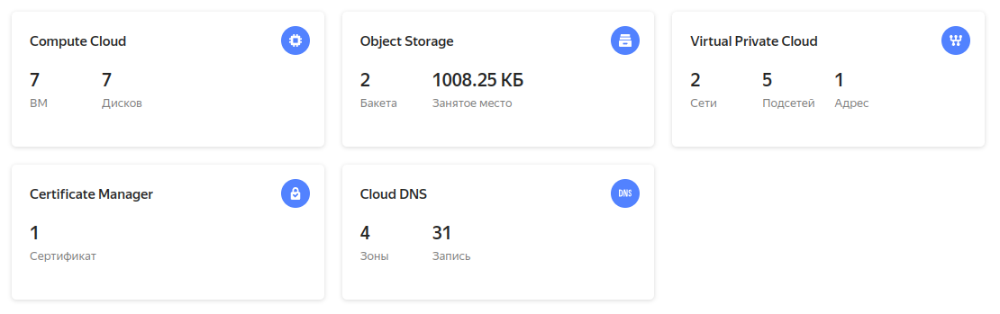

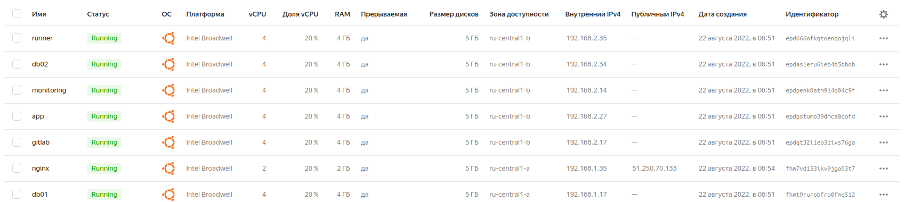


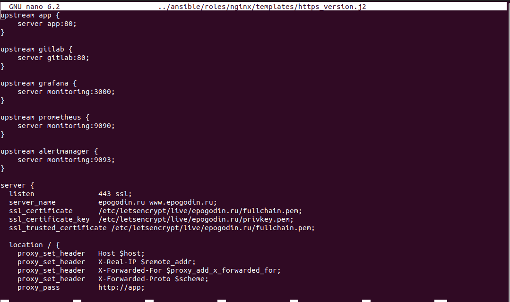

---
### Установка Nginx и LetsEncrypt

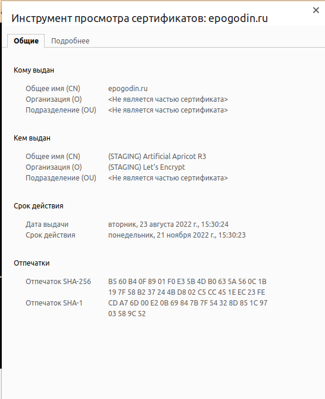

---
### Установка кластера MySQL

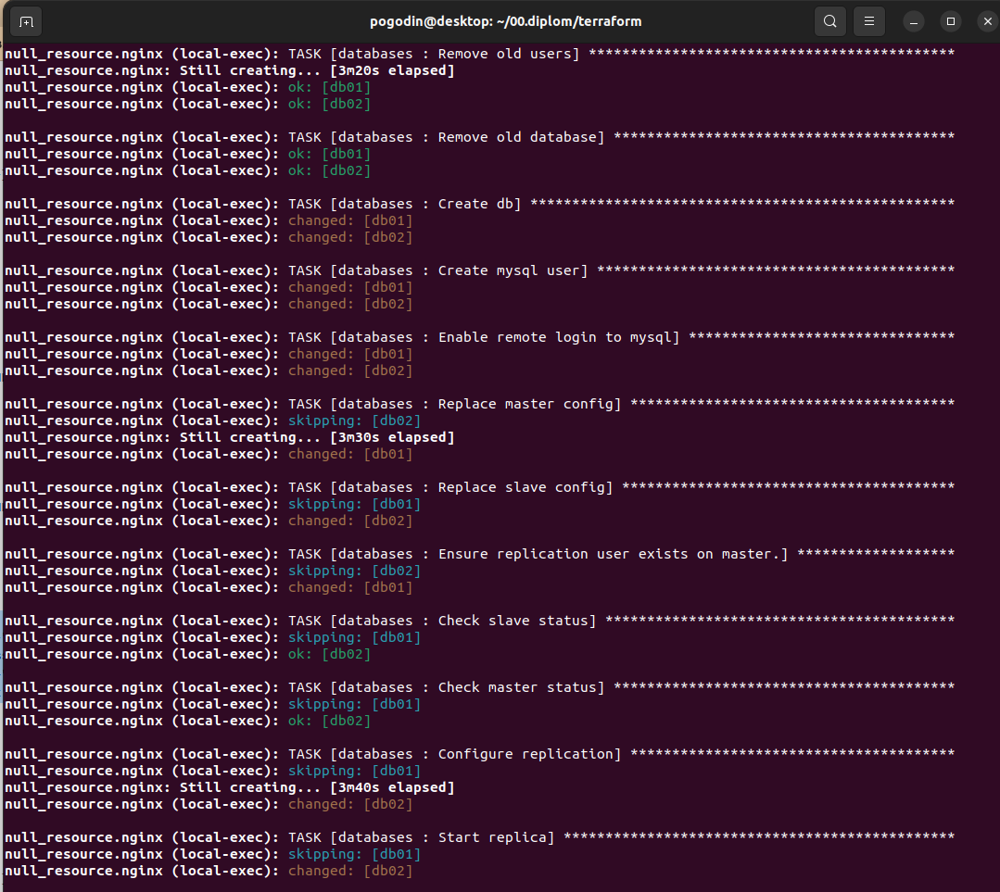

---
### Установка WordPress

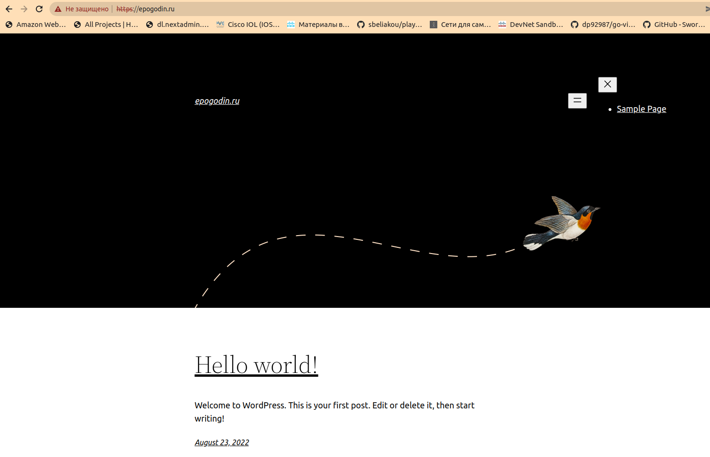

---
### Установка Gitlab CE и Gitlab Runner

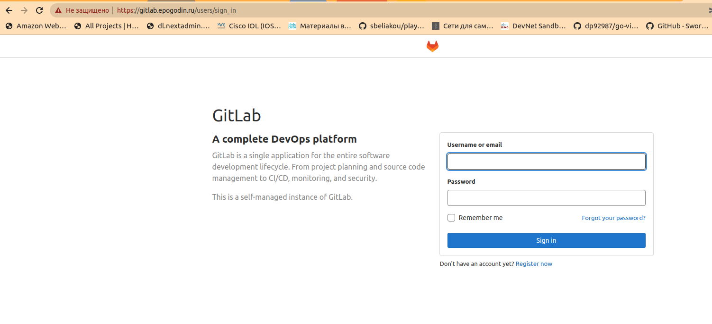

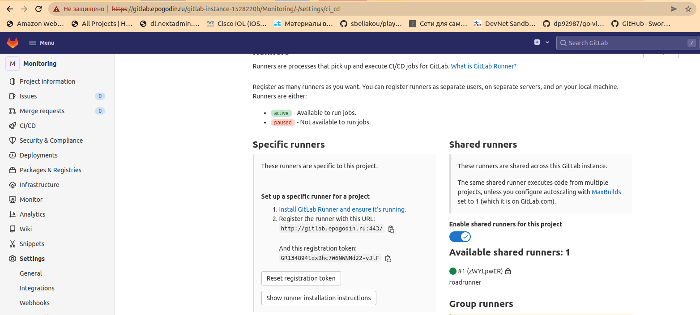

---
### Установка Prometheus, Alert Manager, Node Exporter и Grafana

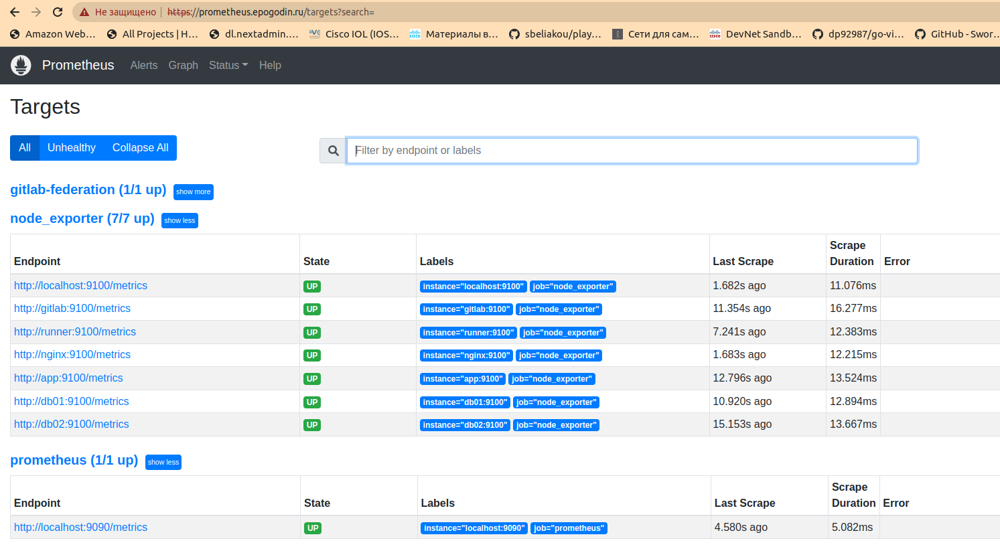

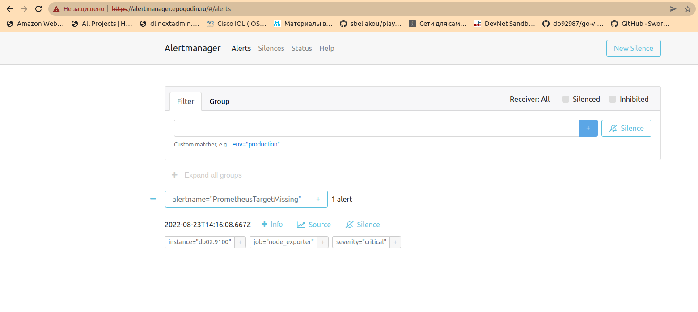

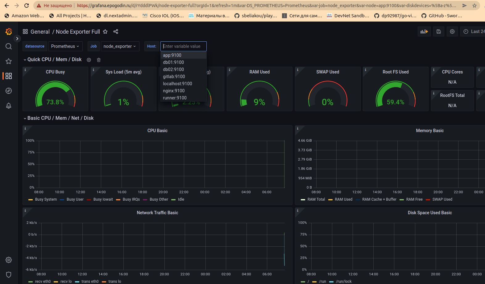

---
### Титры

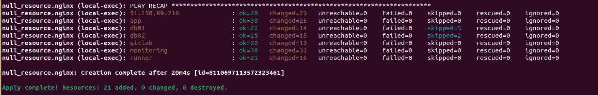

---
### Файлы конфигурации

[terraform](https://github.com/pogodin2004/netologyHomeWorks/tree/master/00.diplom/terraform)

[ansible](https://github.com/pogodin2004/netologyHomeWorks/tree/master/00.diplom/ansible)

