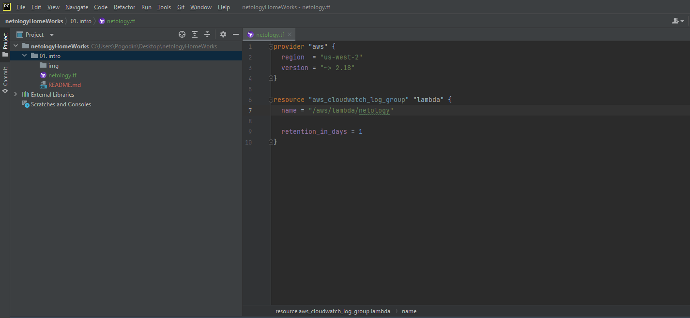
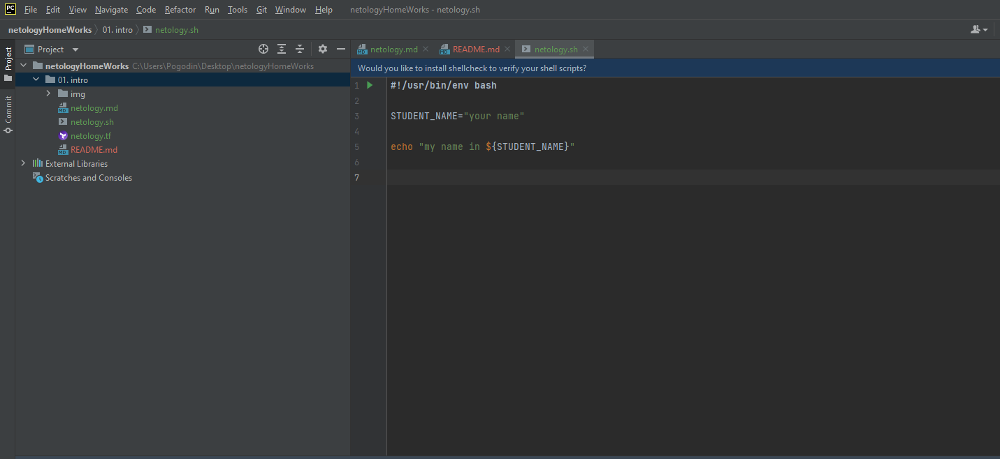
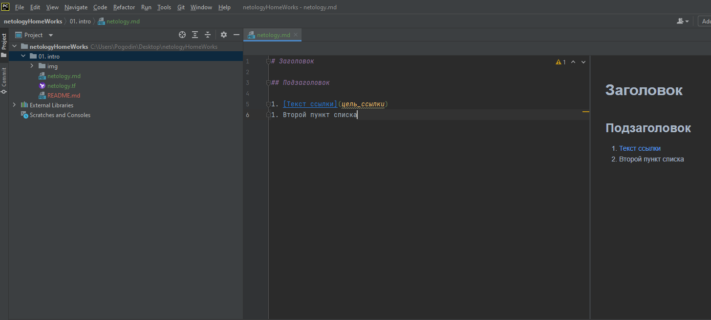
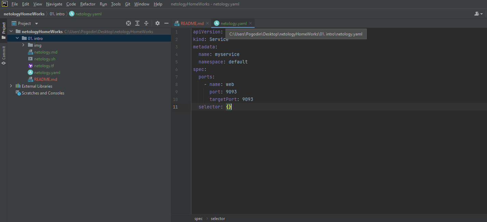
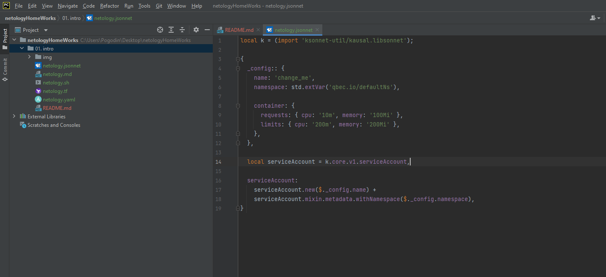

# Домашнее задание к занятию «1.1. Введение в DevOps»
## Задание №1 - Подготовка рабочей среды
   Проверка подсветки синтатксиса:
   * Terraform

   * Bash

   * Markdown

   * YAML

   * Jsonnet

## Задание №2 - Описание жизненного цикла задачи (разработки нового функционала)