# Домашнее задание к занятию «2.3. Ветвления в Git»
## Задание №1 – Ветвление, merge и rebase.

   1. Создайте в своем репозитории каталог `branching` и в нем два файла `merge.sh` и `rebase.sh` с содержимым:

   2. Создадим коммит с описанием `prepare for merge and rebase` и отправим его в ветку `master`

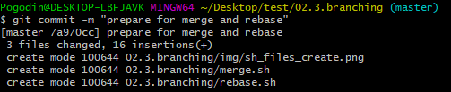

### Подготовка файла merge.sh.
   1. Создайте ветку `git-merge`.
   2. Замените в ней содержимое файла `merge.sh`
   3. Создайте коммит `merge: @ instead *` отправьте изменения в репозиторий.

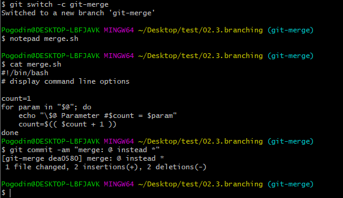

   4. И разработчик подумал и решил внести еще одно изменение в `merge.sh`
   5. Создайте коммит merge: use shift и отправьте изменения в репозиторий.

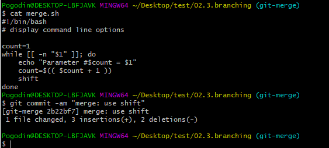
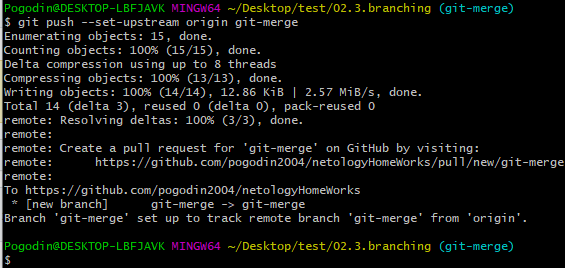

### Изменим master

   1. Вернитесь в ветку `master`.
   2. Предположим, что кто-то, пока мы работали над веткой `git-merge`, изменил `master`. Для этого изменим содержимое файла `rebase.sh`.
   3. Отправляем измененную ветку `master` в репозиторий.

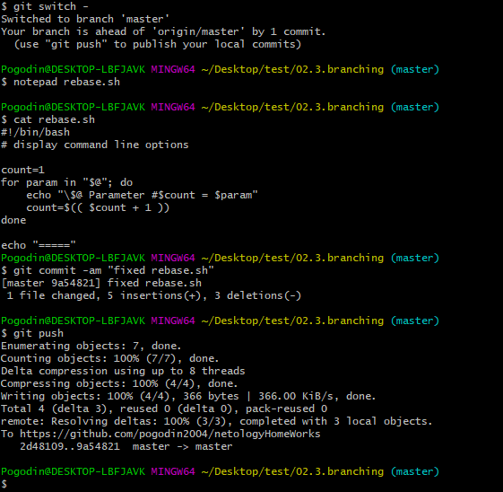

### Подготовка файла rebase.sh.
   1. Предположим, что теперь другой участник нашей команды не сделал `git pull`, либо просто хотел ответвиться не от последнего коммита в `master`, а от коммита когда мы только создали два файла `merge.sh` и `rebase.sh` на первом шаге.
   Для этого при помощи команды `git log` найдем хэш коммита `prepare for merge and rebase` и выполним `git checkout` на него.
   2. Создадим ветку `git-rebase` основываясь на текущем коммите.
   3. И изменим содержимое файла `rebase.sh`.
   4. Отправим эти изменения в ветку `git-rebase`, с комментарием `git-rebase 1`.

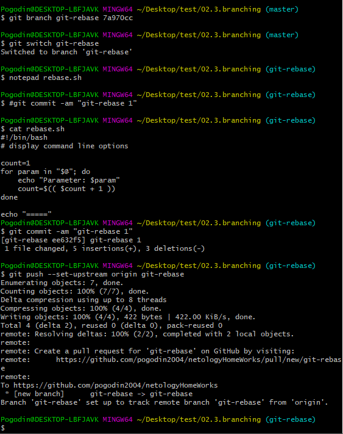

   5. И сделаем еще один коммит `git-rebase 2` с пушем заменив `echo "Parameter: $param"` на `echo "Next parameter: $param"`.

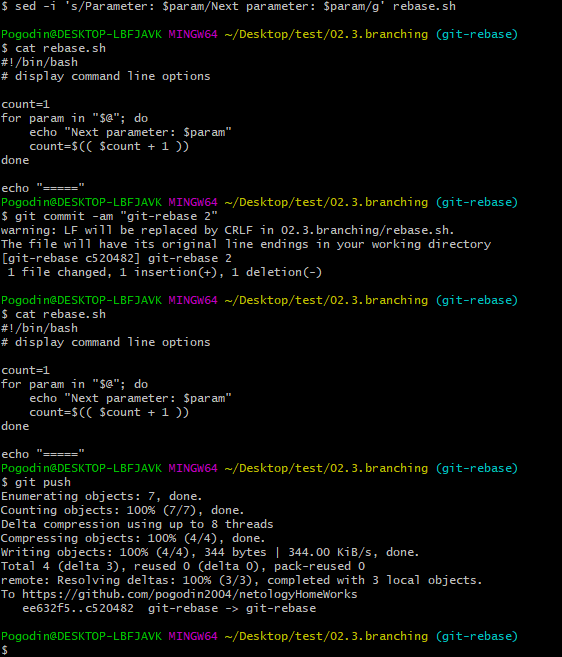

### Промежуточный итог:

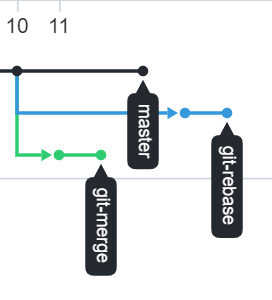

### Merge
   Сливаем ветку `git-merge` в `master` и отправляем изменения в репозиторий, должно получиться без конфликтов:

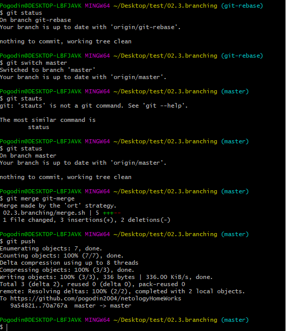
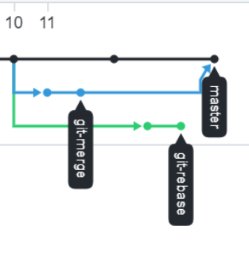

### Rebase
   А перед мержем ветки `git-rebase` выполним ее `rebase` на `master`. Да, мы специально создали ситуацию с конфликтами, чтобы потренироваться их решать.
   Переключаемся на ветку `git-rebase` и выполняем `git rebase -i master`. В открывшемся диалоге должно быть два выполненных нами коммита, давайте заодно объединим их в один, указав слева от нижнего `fixup`. 

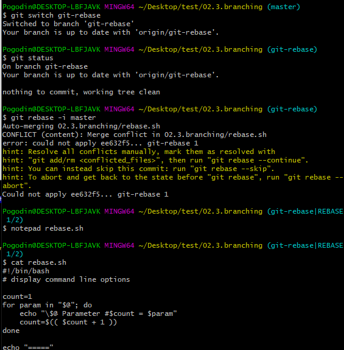

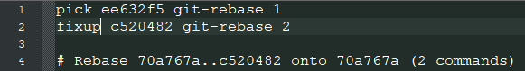

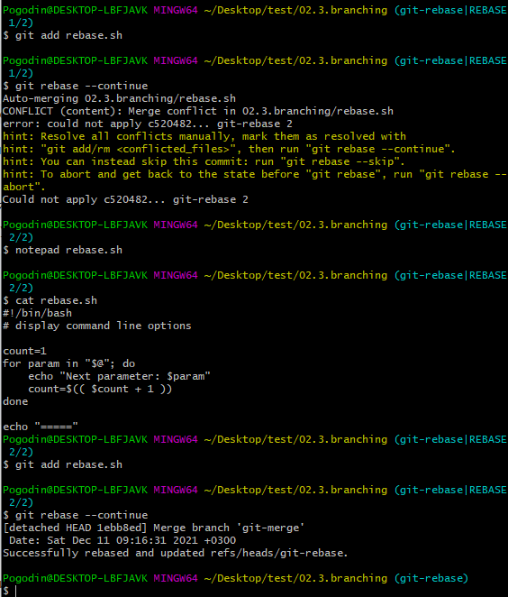

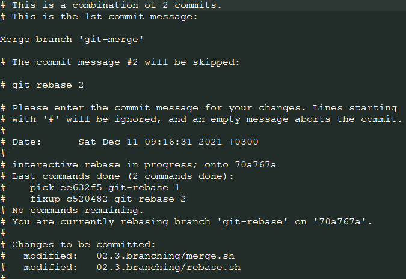

   И попробуем выполнить `git push`, либо `git push -u origin git-rebase` чтобы точно указать что и куда мы хотим запушить. Эта команда завершится с ошибкой:

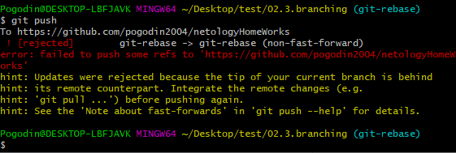

   Это произошло, потому что мы пытаемся перезаписать историю. Чтобы гит позволил нам это сделать, давайте добавим флаг `force`:

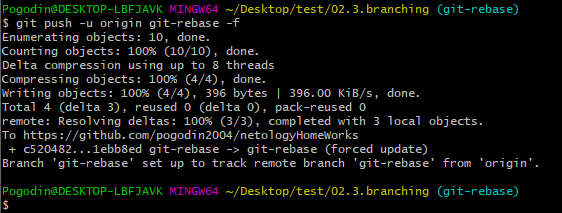

   Теперь можно смержить ветку `git-rebase` в `master` без конфликтов и без дополнительного мерж-комита простой перемоткой.

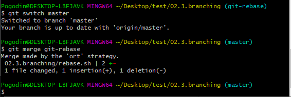

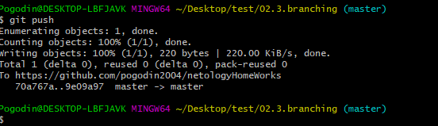