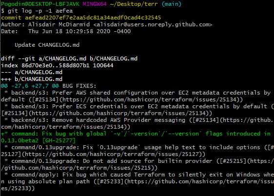
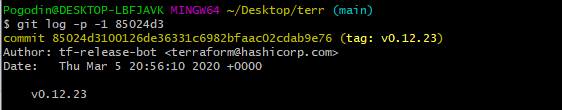
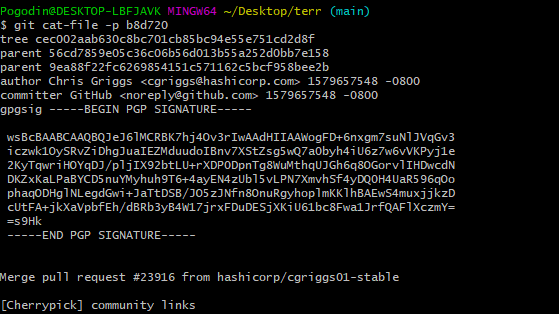
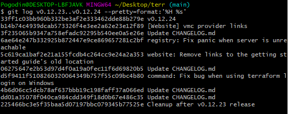
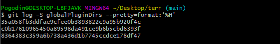
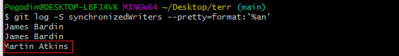

# Домашнее задание к занятию «2.4. Инструменты Git»

   Для выполнения заданий в этом разделе давайте склонируем репозиторий с исходным кодом терраформа https://github.com/hashicorp/terraform

   В виде результата напишите текстом ответы на вопросы и каким образом эти ответы были получены.

   1. Найдите полный хеш и комментарий коммита, хеш которого начинается на aefea.

   2. Какому тегу соответствует коммит 85024d3?

   3. Сколько родителей у коммита b8d720? Напишите их хеши.

   4. Перечислите хеши и комментарии всех коммитов которые были сделаны между тегами v0.12.23 и v0.12.24.

   5. Найдите коммит в котором была создана функция func providerSource, ее определение в коде выглядит так func providerSource(...) (вместо троеточего перечислены аргументы).

   6. Найдите все коммиты в которых была изменена функция globalPluginDirs.

   7. Кто автор функции synchronizedWriters?

