# Домашнее задание к занятию "3.1. Работа в терминале, лекция 1"

   1. Установите средство виртуализации Oracle VirtualBox.
   
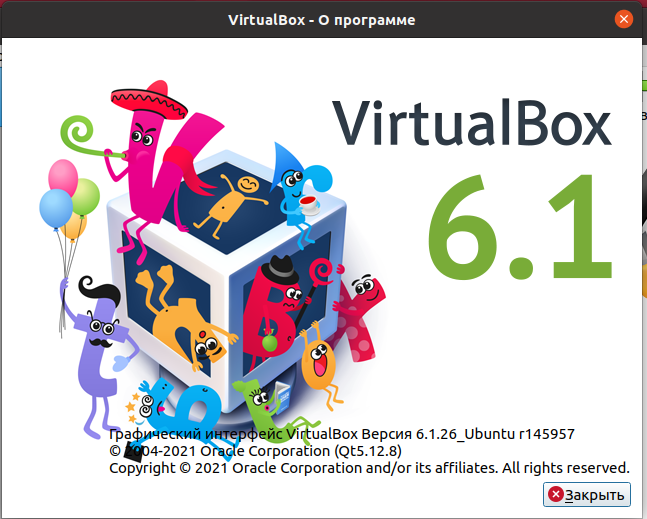

   2. Установите средство автоматизации Hashicorp Vagrant.

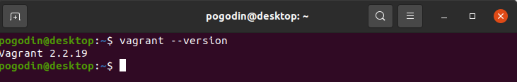

   3. В вашем основном окружении подготовьте удобный для дальнейшей работы терминал
   
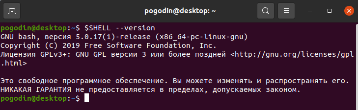

   4. С помощью базового файла конфигурации запустите Ubuntu 20.04 в VirtualBox посредством Vagrant:
   
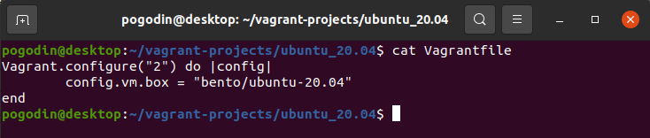

   5. Ознакомьтесь с графическим интерфейсом VirtualBox, посмотрите как выглядит виртуальная машина, которую создал для вас Vagrant, какие аппаратные ресурсы ей выделены. Какие ресурсы выделены по-умолчанию?

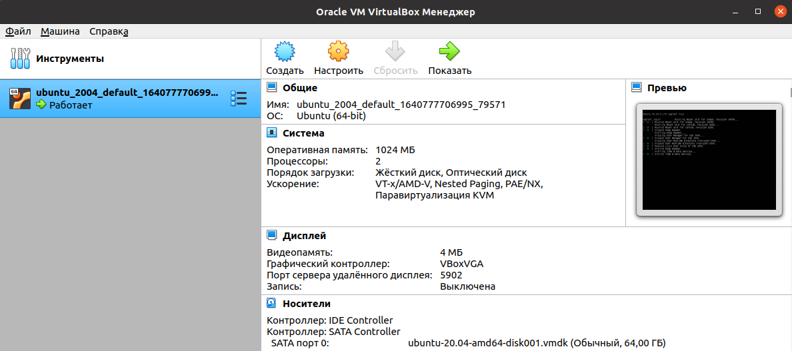

   6. Ознакомьтесь с возможностями конфигурации VirtualBox через Vagrantfile: документация. Как добавить оперативной памяти или ресурсов процессора виртуальной машине?

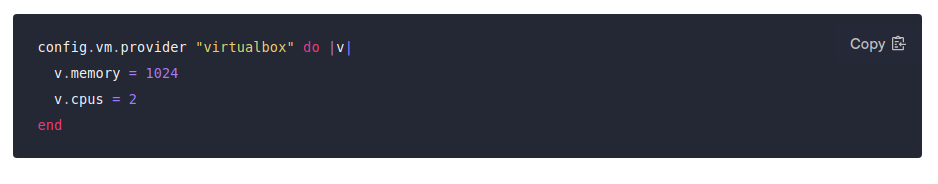

   7. Команда `vagrant ssh` из директории, в которой содержится Vagrantfile, позволит вам оказаться внутри виртуальной машины без каких-либо дополнительных настроек. Попрактикуйтесь в выполнении обсуждаемых команд в терминале Ubuntu.

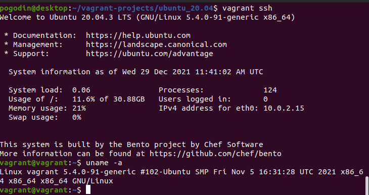

   8. Ознакомиться с разделами man bash, почитать о настройках самого bash:

   * какой переменной можно задать длину журнала history, и на какой строчке manual это описывается?

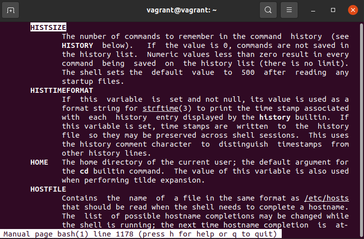

   * что делает директива ignoreboth в bash?

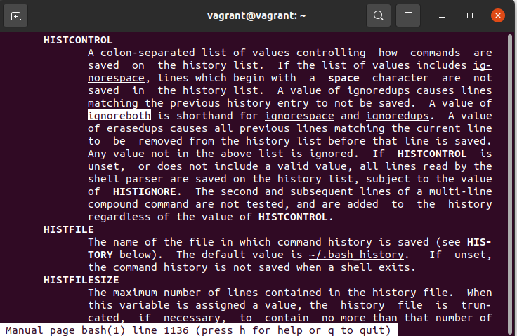

   9. В каких сценариях использования применимы скобки {} и на какой строчке man bash это описано?

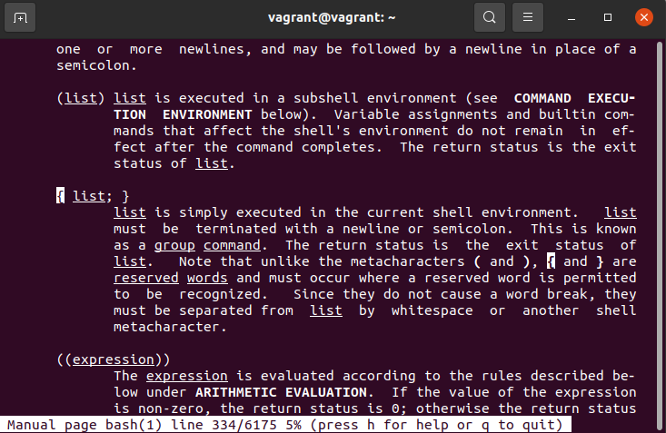

   10. Основываясь на предыдущем вопросе, как создать однократным вызовом touch 100000 файлов? А получилось ли создать 300000? Если нет, то почему?

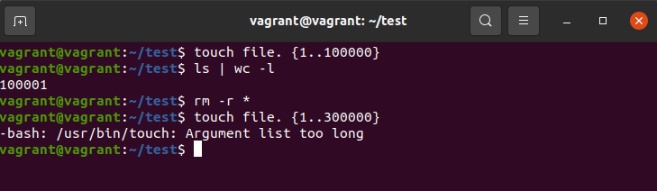
   
   11. В man bash поищите по `/\[\[`. Что делает конструкция `[[ -d /tmp ]]`
   
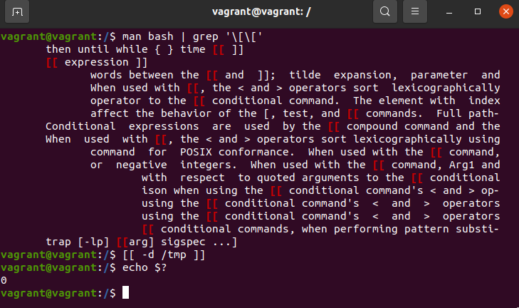

   12. Основываясь на знаниях о просмотре текущих (например, PATH) и установке новых переменных; командах, которые мы рассматривали, добейтесь в выводе `type -a bash` в виртуальной машине наличия первым пунктом в списке:

```
bash is /tmp/new_path_directory/bash
bash is /usr/local/bin/bash
bash is /bin/bash
```

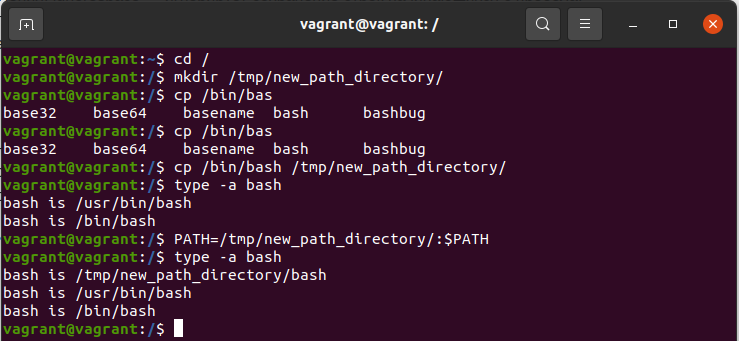

   13. Чем отличается планирование команд с помощью batch и at?
   
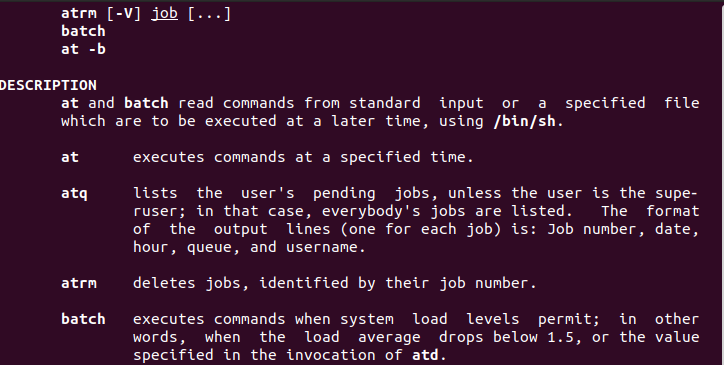

   14. Завершите работу виртуальной машины чтобы не расходовать ресурсы компьютера и/или батарею ноутбука.
   
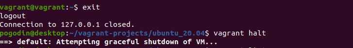
