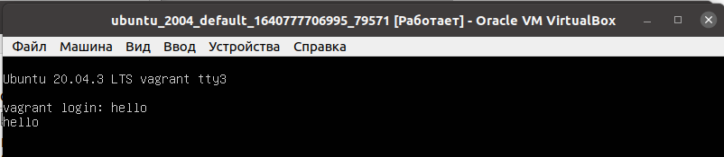
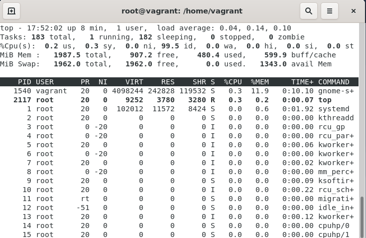
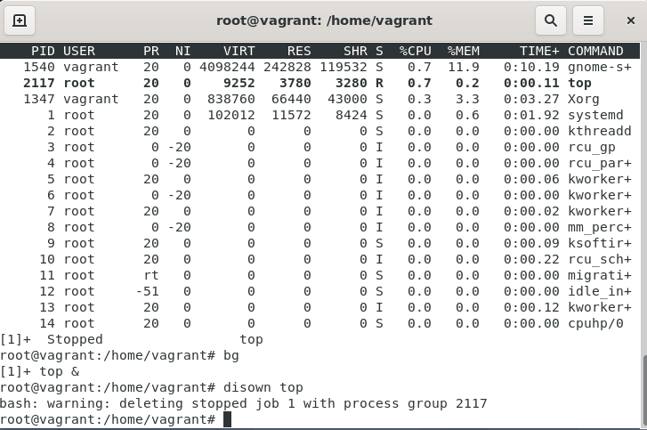
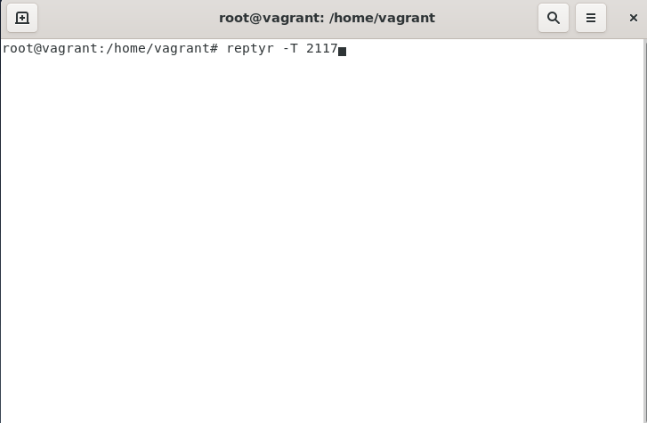

# Домашнее задание к занятию "3.2. Работа в терминале, лекция 2"

1. Какого типа команда `cd`? Попробуйте объяснить, почему она именно такого типа.


```
   Команда cd встроена в shell. При вызове внешней программы операционная система запускает
отдельный процесс, в то время как встроенная программа является частью самой программы
оболочки и будет иметь намного меньшие издержки. Эти издержки незначительны, но если вы
команду выполнять много раз, это может оказать влияние на производительность.
```

2. Какая альтернатива без pipe команде grep `<some_string> <some_file> | wc -l`? `man grep` поможет в ответе на этот вопрос.


3. Какой процесс с `PID 1` является родителем для всех процессов в вашей виртуальной машине Ubuntu 20.04?


4. Как будет выглядеть команда, которая перенаправит вывод `stderr ls` на другую сессию терминала?


5. Получится ли одновременно передать команде файл на `stdin` и вывести ее `stdout` в другой файл? Приведите работающий пример.


6. Получится ли вывести находясь в графическом режиме данные из `PTY` в какой-либо из эмуляторов `TTY`? Сможете ли вы наблюдать выводимые данные?




7. Выполните команду `bash 5>&1`. К чему она приведет? Что будет, если вы выполните `echo netology > /proc/$$/fd/5`?


8. Получится ли в качестве входного потока для `pipe` использовать только `stderr` команды, не потеряв при этом отображение `stdout` на `pty`? Напоминаем: по умолчанию через `pipe` передается только `stdout` команды слева от `|` на `stdin` команды справа. Это можно сделать, поменяв стандартные потоки местами через промежуточный новый дескриптор, который вы научились создавать в предыдущем вопросе.


9. Что выведет команда `cat /proc/$$/environ`? Как еще можно получить аналогичный по содержанию вывод?


10. Используя `man`, опишите что доступно по адресам `/proc/<PID>/cmdline`, `/proc/<PID>/exe`.


11. Узнайте, какую наиболее старшую версию набора инструкций `SSE` поддерживает ваш процессор с помощью `/proc/cpuinfo`.

```
sse4_2
```


12. При открытии нового окна терминала и `vagrant ssh` создается новая сессия и выделяется `pty`. Это можно подтвердить командой `tty`, которая упоминалась в лекции 3.2. Однако:

```
vagrant@netology1:~$ ssh localhost 'tty'
not a tty
```
Почитайте, почему так происходит, и как изменить поведение.


13. Бывает, что есть необходимость переместить запущенный процесс из одной сессии в другую. Попробуйте сделать это, воспользовавшись `reptyr`. Например, так можно перенести в `screen` процесс, который вы запустили по ошибке в обычной `SSH`-сессии.

   * запускаем `top`



   * останавливаем `top`, запускаем в фоне и изолируем дочерний процесс от родительского
   


   * запускаем `screen`
   


   * возобновляем работу `top`



14. `sudo echo string > /root/new_file` не даст выполнить перенаправление под обычным пользователем, так как перенаправлением занимается процесс `shell`'а, который запущен без `sudo` под вашим пользователем. Для решения данной проблемы можно использовать конструкцию `echo string | sudo tee /root/new_file`. Узнайте что делает команда `tee` и почему в отличие от `sudo echo` команда с `sudo tee` будет работать.


```
Команда tee получает данные из stdin и записывает их в stdout. Для tee можно повысить привилегии, для echo - нет.
```
