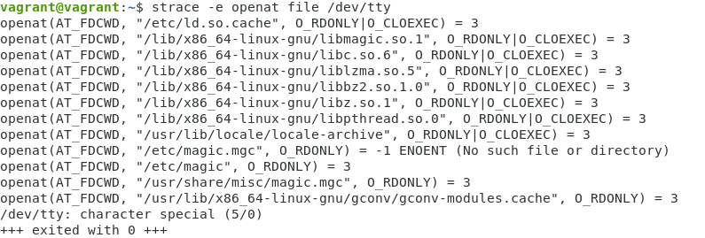
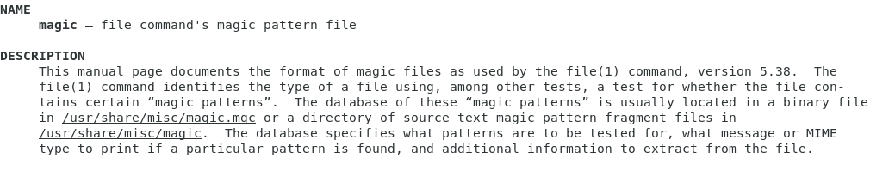
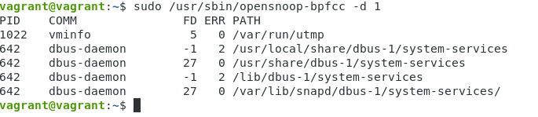
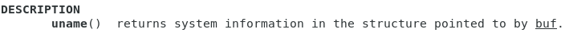
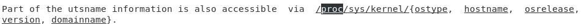
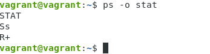

1. Какой системный вызов делает команда `cd`? В прошлом ДЗ мы выяснили, что `cd` не является самостоятельной программой, это `shell builtin`, поэтому запустить `strace` непосредственно на `cd` не получится. Тем не менее, вы можете запустить `strace` на `/bin/bash -c 'cd /tmp'`. В этом случае вы увидите полный список системных вызовов, которые делает сам `bash` при старте. Вам нужно найти тот единственный, который относится именно к `cd`.


2. Попробуйте использовать команду `file` на объекты разных типов на файловой системе. Например:
```
vagrant@netology1:~$ file /dev/tty
/dev/tty: character special (5/0)
vagrant@netology1:~$ file /dev/sda
/dev/sda: block special (8/0)
vagrant@netology1:~$ file /bin/bash
/bin/bash: ELF 64-bit LSB shared object, x86-64
```
   Используя `strace` выясните, где находится база данных `file` на основании которой она делает свои догадки.
   

```
/usr/share/misc/magic.mgc
```


3. Предположим, приложение пишет лог в текстовый файл. Этот файл оказался удален (`deleted` в `lsof`), однако возможности сигналом сказать приложению переоткрыть файлы или просто перезапустить приложение – нет. Так как приложение продолжает писать в удаленный файл, место на диске постепенно заканчивается. Основываясь на знаниях о перенаправлении потоков предложите способ обнуления открытого удаленного файла (чтобы освободить место на файловой системе).

```
находим PID и fd удаленного файла: sudo lsof | grep deleted
"обнуляем" файл: > /proc/<PID>/fd/<fd>
```

4. Занимают ли зомби-процессы какие-то ресурсы в ОС (CPU, RAM, IO)?

```
   Зомби - это процесс в Unix-системе, завершивший своё выполнение, но ещё присутствующий в списке процессов операционной системы, чтобы дать родительскому процессу считать код завершения.
   Процесс при завершении (как нормальном, так и в результате не обрабатываемого сигнала) освобождает все свои ресурсы и становится «зомби» — пустой записью в таблице процессов, хранящей статус завершения, предназначенный для чтения родительским процессом.
   Зомби не занимают памяти (как процессы-сироты), но блокируют записи в таблице процессов, размер которой ограничен для каждого пользователя и системы в целом.
```

5. В `iovisor BCC` есть утилита `opensnoop`:
```
root@vagrant:~# dpkg -L bpfcc-tools | grep sbin/opensnoop
/usr/sbin/opensnoop-bpfcc
```
   На какие файлы вы увидели вызовы группы open за первую секунду работы утилиты? Воспользуйтесь пакетом `bpfcc-tools` для `Ubuntu 20.04`. 



6. Какой системный вызов использует `uname -a`? Приведите цитату из `man` по этому системному вызову, где описывается альтернативное местоположение в `/proc`, где можно узнать версию ядра и релиз ОС.




7. Чем отличается последовательность команд через `;` и через `&&` в `bash`? Например:
```
root@netology1:~# test -d /tmp/some_dir; echo Hi
Hi
root@netology1:~# test -d /tmp/some_dir && echo Hi
root@netology1:~#
```
   Есть ли смысл использовать в `bash &&`, если применить `set -e`?

```
&& - логическое "И": вторая команда выполнится, если первая выполнена успешно
";" - разделитель нескольких послежовательно выполняемых команд
set -e - выход из пайплайна, если любая команда завершится с ненулевым статусом.
Совместное использование команд && и set -e не имеет смысла, т.к. при возникновении ошибки, в любом случае произойдет выход из цепочки выполняемых команд.

```

8. Из каких опций состоит режим `bash set -euxo pipefail` и почему его хорошо было бы использовать в сценариях?

```
-e  Exit immediately if a command exits with a non-zero status.
-u  Treat unset variables as an error when substituting.
-x  Print commands and their arguments as they are executed.
-o  pipefail - the return value of a pipeline is the status of the last command to exit with a non-zero status, or zero if no command exited with a non-zero status
```

9. Используя `-o stat` для `ps`, определите, какой наиболее часто встречающийся статус у процессов в системе. В man `ps` ознакомьтесь (`/PROCESS STATE CODES`) что значат дополнительные к основной заглавной буквы статуса процессов. Его можно не учитывать при расчете (считать `S`, `Ss` или `Ssl` равнозначными).



```
S - interruptible sleep (waiting for an event to complete
R - running or runnable (on run queue)
s - is a session leader
+ - is in the foreground process group
```
