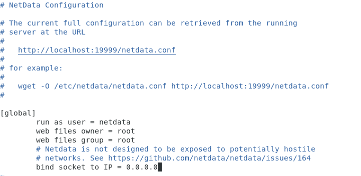
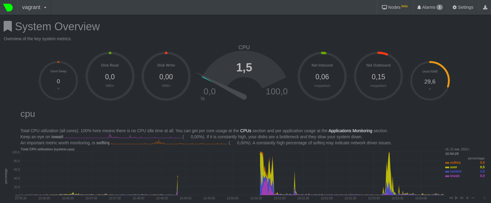

# Домашнее задание к занятию "3.4. Операционные системы, лекция 2"

1. Создайте самостоятельно простой unit-файл для node_exporter:
   * поместите его в автозагрузку,
   * предусмотрите возможность добавления опций к запускаемому процессу через внешний файл (посмотрите, например, на `systemctl cat cron`),
   * удостоверьтесь, что с помощью `systemctl` процесс корректно стартует, завершается, а после перезагрузки автоматически поднимается.


2. Ознакомьтесь с опциями `node_exporter` и выводом `/metrics` по-умолчанию. Приведите несколько опций, которые вы бы выбрали для базового мониторинга хоста по CPU, памяти, диску и сети.


3. Установите в свою виртуальную машину `Netdata`. Воспользуйтесь готовыми пакетами для установки (`sudo apt install -y netdata`). После успешной установки:
   * в конфигурационном файле `/etc/netdata/netdata.conf` в секции `[web]` замените значение с `localhost` на `bind to = 0.0.0.0`,
   * добавьте в `Vagrantfile` проброс порта `Netdata` на свой локальный компьютер и сделайте `vagrant reload`:
```
config.vm.network "forwarded_port", guest: 19999, host: 19999
```
   После успешной перезагрузки в браузере на своем ПК (не в виртуальной машине) вы должны суметь зайти на `localhost:19999`. Ознакомьтесь с метриками, которые по умолчанию собираются `Netdata` и с комментариями, которые даны к этим метрикам.
   







4. Можно ли по выводу `dmesg` понять, осознает ли ОС, что загружена не на настоящем оборудовании, а на системе виртуализации?


5. Как настроен `sysctl` `fs.nr_open` на системе по-умолчанию? Узнайте, что означает этот параметр. Какой другой существующий лимит не позволит достичь такого числа (`ulimit --help`)?


```
s.nr_open - максимальное число файловых дескрипторов на процесс
ulimit -Sn - "мягкое" ограничение максимального числа дескрипторов открытых файлов
ulimit -Hn -- "жесткое" ограничение максимального числа дескрипторов открытых файлов
```
6. Запустите любой долгоживущий процесс (не `ls`, который отработает мгновенно, а, например, `sleep 1h`) в отдельном неймспейсе процессов; покажите, что ваш процесс работает под `PID 1` через `nsenter`. Для простоты работайте в данном задании под `root` (`sudo -i`). 


7. Найдите информацию о том, что такое `:(){ :|:& };:`. Запустите эту команду в своей виртуальной машине `Vagrant` с `Ubuntu 20.04` (это важно, поведение в других ОС не проверялось). Некоторое время все будет "плохо", после чего (минуты) – ОС должна стабилизироваться. Вызов `dmesg` расскажет, какой механизм помог автоматической стабилизации. Как настроен этот механизм по-умолчанию, и как изменить число процессов, которое можно создать в сессии?

```
:(){ :|: & };: - функция командной оболочки, которая создает свои собственные копии. Процесс постоянно воспроизводит себя, и его копии постоянно размножаться, быстро занимая все свое процессорное время и всю память. Это может привести к остановке компьютера. Это, в большей степени, атака вида denial-of-service (отказ в обслуживании).
```


```
Изменить число процессов сессий можно изменив значение параметра kernel.pid_max
```


