# Домашнее задание к занятию "3.5. Файловые системы"

1. Узнайте о `sparse` (разряженных) файлах.

```
Разрежённый файл (англ. sparse file) — файл, в котором последовательности нулевых байтов[1] заменены на информацию  
об этих последовательностях (список дыр).
Дыра (англ. hole) — последовательность нулевых байт внутри файла, не записанная на диск. Информация о дырах  
(смещение от начала файла в байтах и количество байт) хранится в метаданных ФС.
Преимущества:
   * экономия дискового пространства. Использование разрежённых файлов считается одним из способов сжатия данных  
на уровне файловой системы;
   * отсутствие временных затрат на запись нулевых байт;
   * увеличение срока службы запоминающих устройств.
Недостатки:
   * накладные расходы на работу со списком дыр;
   * фрагментация файла при частой записи данных в дыры;
   * невозможность записи данных в дыры при отсутствии свободного места на диске;
   * невозможность использования других индикаторов дыр, кроме нулевых байт.
```

2. Могут ли файлы, являющиеся жесткой ссылкой на один объект, иметь разные права доступа и владельца? Почему?

```
  Жесткая ссылка (hard link) является своего рода синонимом для существующего файла. Когда вы создаете жесткую ссылку,  
создается дополнительный указатель на существующий файл, но не копия файла.
  Жесткие ссылки выглядят в файловой структуре как еще один файл. Если вы создаете жесткую ссылку в том же каталоге,  
где находится целевой файл, то они должны иметь разные имена. Жесткая ссылка на файл должна находится в той же файловой  
системе, где и другие жесткие ссылки на этот файл.
  В Linux каждый файл имеет уникальный идентификатор - индексный дескриптор (inode). Это число, которое однозначно  
идентифицирует файл в файловой системе. Жесткая ссылка и файл, для которой она создавалась имеют одинаковые inode. 
  Поэтому жесткая ссылка имеет те же права доступа, владельца и время последней модификации, что и целевой файл.  
Различаются только имена файлов. Фактически жесткая ссылка это еще одно имя для файла.
```

3. Сделайте `vagrant destroy` на имеющийся инстанс `Ubuntu`. Замените содержимое `Vagrantfile` следующим:

```
Vagrant.configure("2") do |config|
  config.vm.box = "bento/ubuntu-20.04"
  config.vm.provider :virtualbox do |vb|
    lvm_experiments_disk0_path = "/tmp/lvm_experiments_disk0.vmdk"
    lvm_experiments_disk1_path = "/tmp/lvm_experiments_disk1.vmdk"
    vb.customize ['createmedium', '--filename', lvm_experiments_disk0_path, '--size', 2560]
    vb.customize ['createmedium', '--filename', lvm_experiments_disk1_path, '--size', 2560]
    vb.customize ['storageattach', :id, '--storagectl', 'SATA Controller', '--port', 1, '--device', 0, '--type', 'hdd', '--medium', lvm_experiments_disk0_path]
    vb.customize ['storageattach', :id, '--storagectl', 'SATA Controller', '--port', 2, '--device', 0, '--type', 'hdd', '--medium', lvm_experiments_disk1_path]
  end
end
```

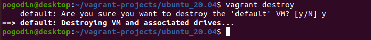

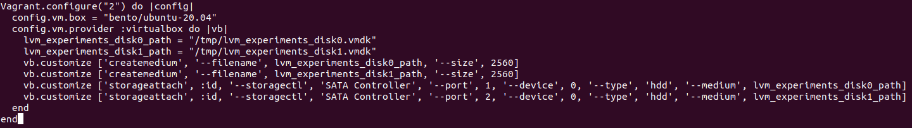

   Данная конфигурация создаст новую виртуальную машину с двумя дополнительными неразмеченными дисками по 2.5 Гб.
   
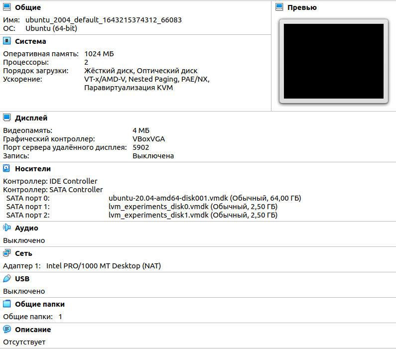

4. Используя `fdisk`, разбейте первый диск на 2 раздела: 2 Гб, оставшееся пространство.

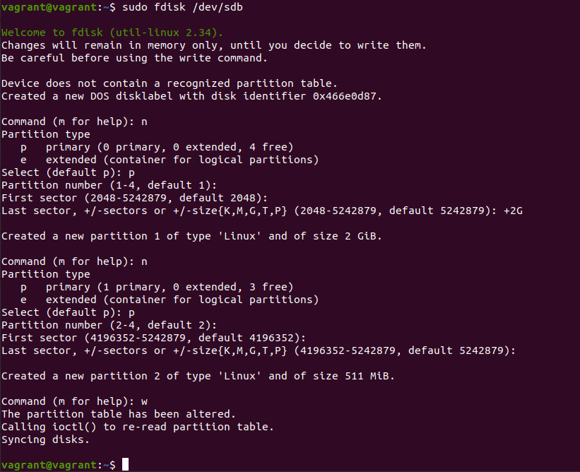

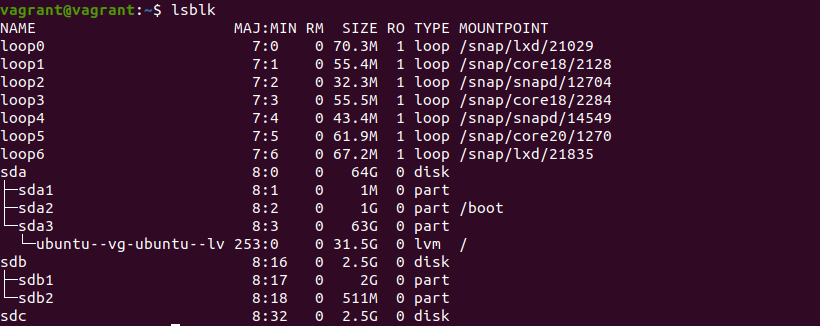

5. Используя `sfdisk`, перенесите данную таблицу разделов на второй диск.

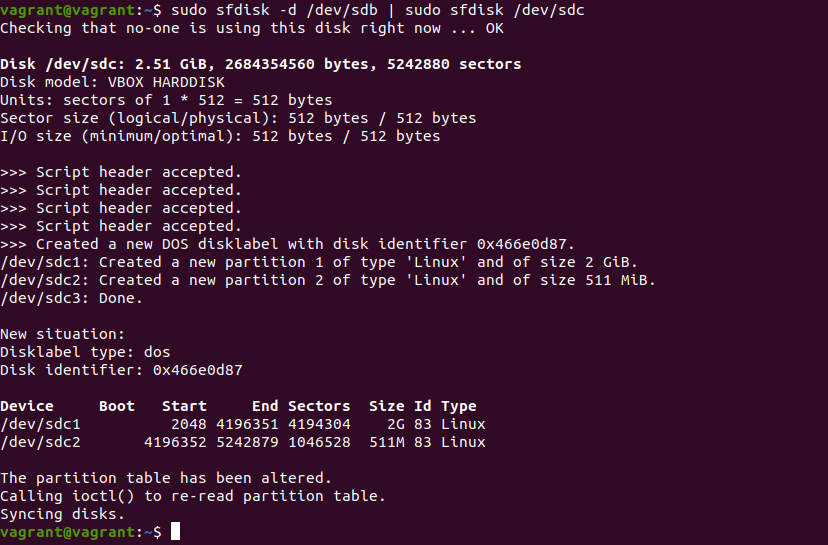

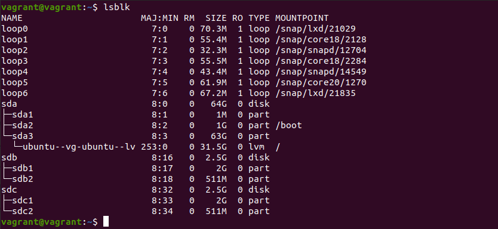

6. Соберите `mdadm` `RAID1` на паре разделов 2 Гб.

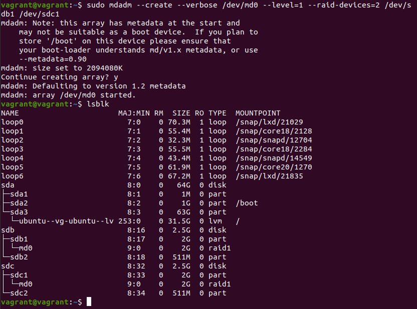

7. Соберите `mdadm` `RAID0` на второй паре маленьких разделов.

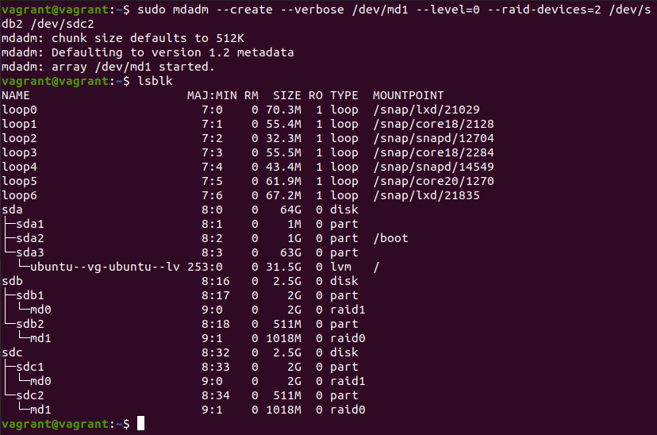

8. Создайте 2 независимых `PV` на получившихся `md`-устройствах.

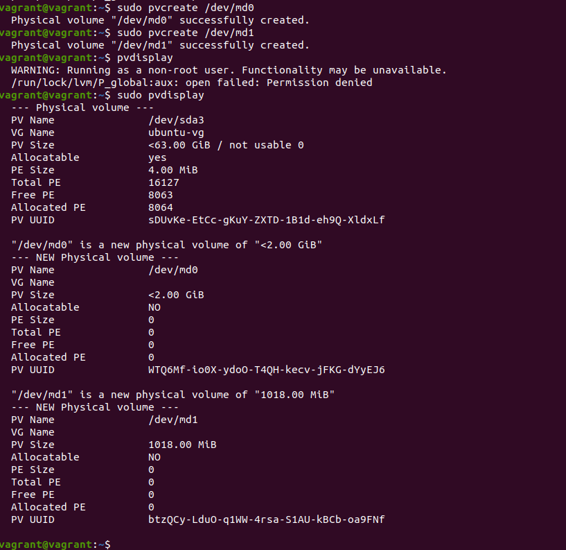

9. Создайте общую `volume-group` на этих двух `PV`.

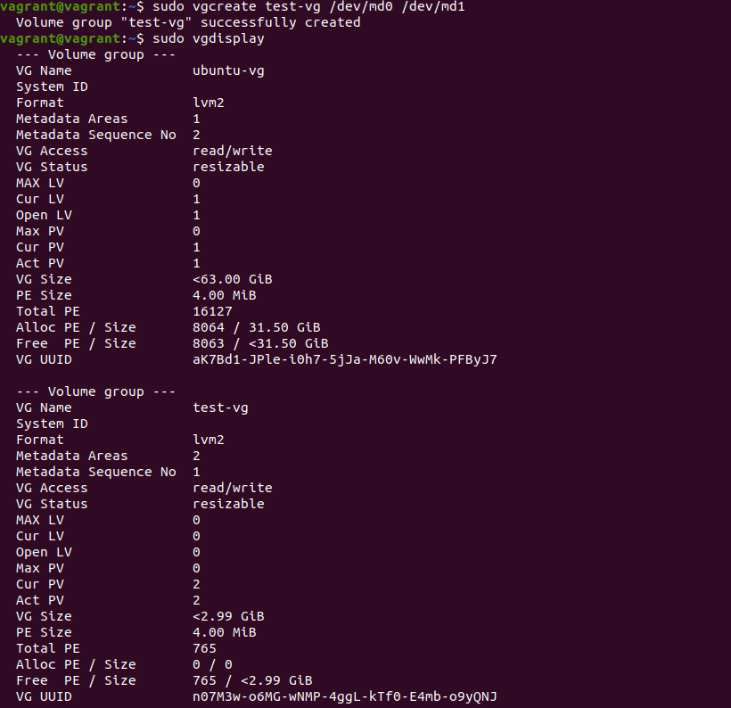

10. Создайте `LV` размером 100 Мб, указав его расположение на `PV` с `RAID0`.

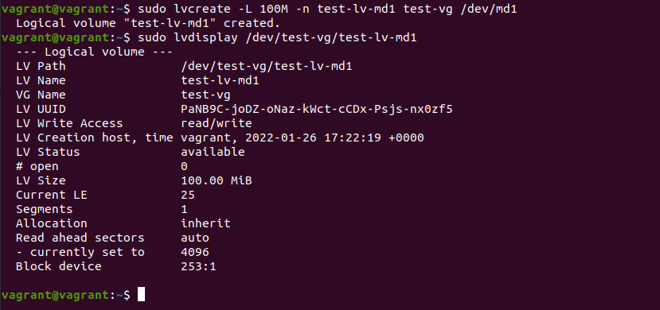

11. Создайте `mkfs.ext4` ФС на получившемся `LV`.

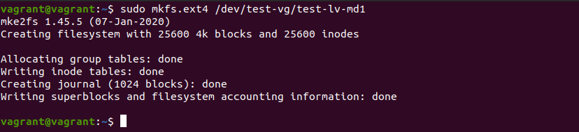

12. Смонтируйте этот раздел в любую директорию, например, `/tmp/new`.

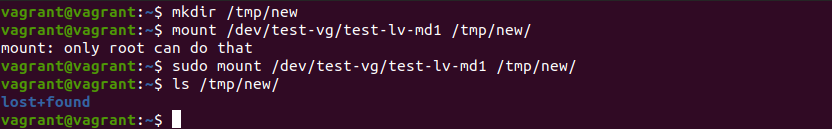

13. Поместите туда тестовый файл, например `wget https://mirror.yandex.ru/ubuntu/ls-lR.gz -O /tmp/new/test.gz`.

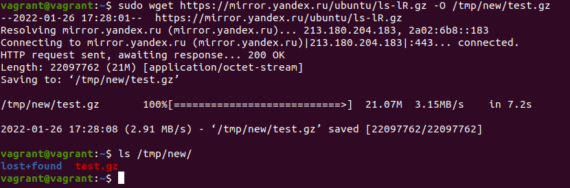

14. Прикрепите вывод `lsblk`.

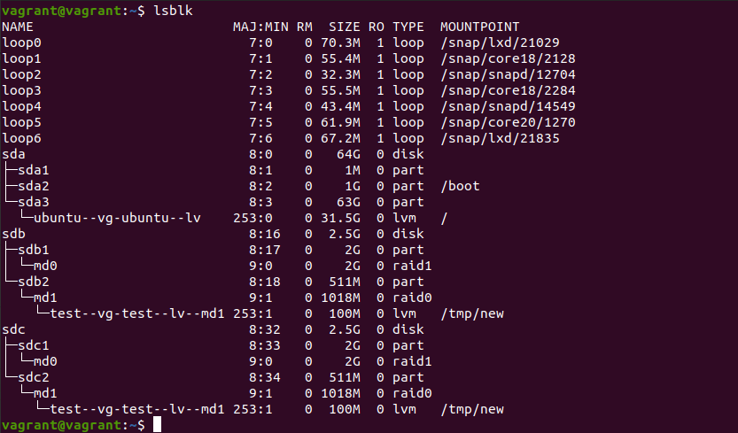

15. Протестируйте целостность файла:

```
root@vagrant:~# gzip -t /tmp/new/test.gz
root@vagrant:~# echo $?
0
```

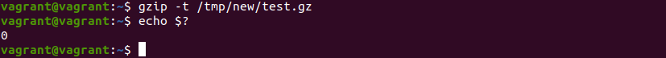

16. Используя `pvmove`, переместите содержимое `PV` с `RAID0` на `RAID1`.

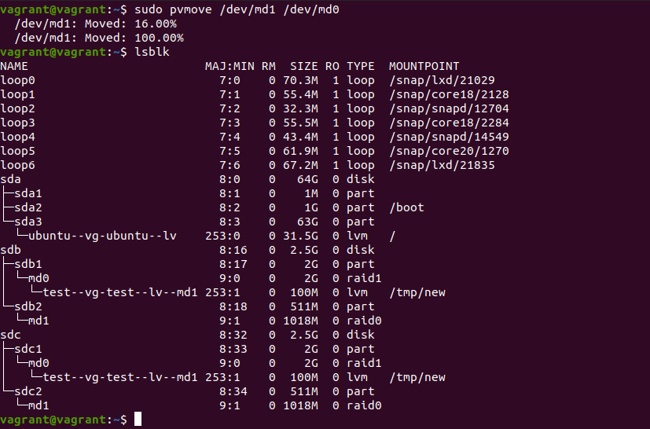

17. Сделайте `--fail` на устройство в вашем `RAID1 md`.

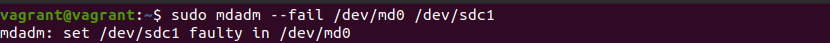

18. Подтвердите выводом `dmesg`, что `RAID1` работает в деградированном состоянии.

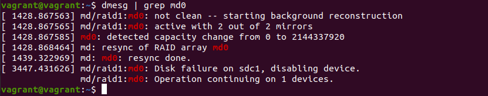

19. Протестируйте целостность файла, несмотря на "сбойный" диск он должен продолжать быть доступен:

```
root@vagrant:~# gzip -t /tmp/new/test.gz
root@vagrant:~# echo $?
0
```

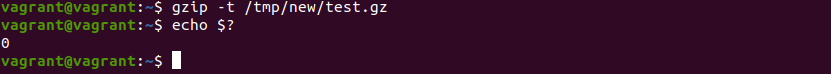

20. Погасите тестовый хост, `vagrant destroy`.

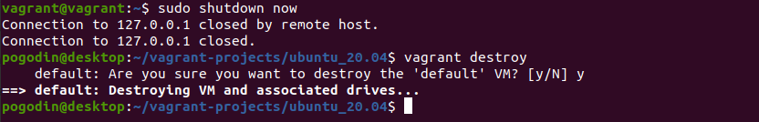

