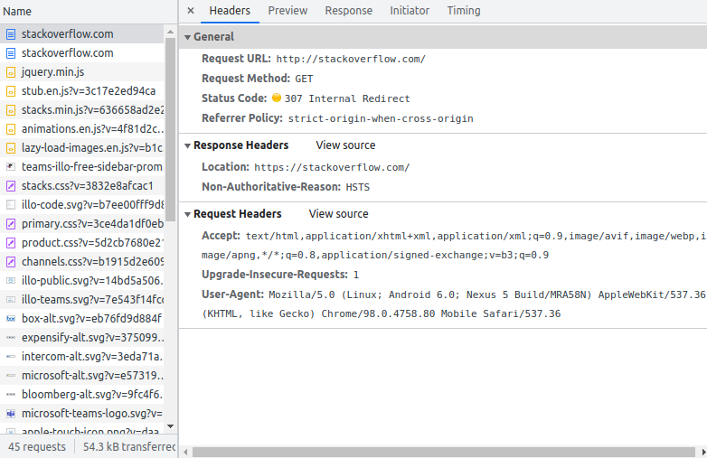
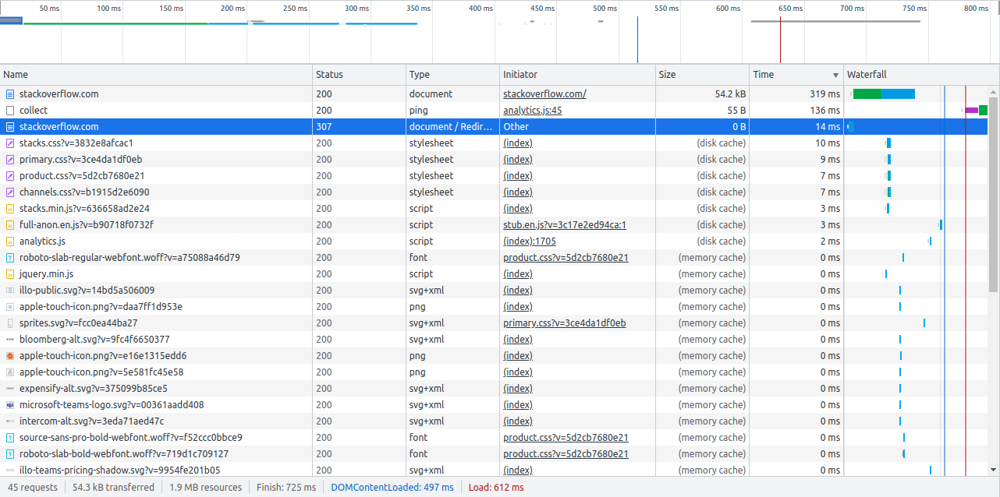
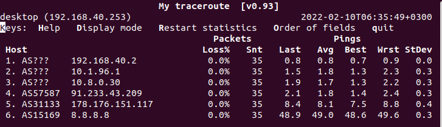
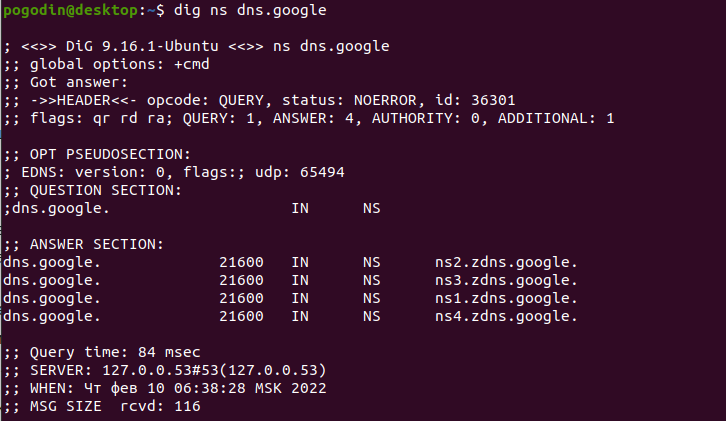
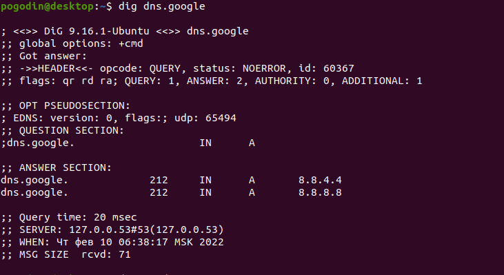
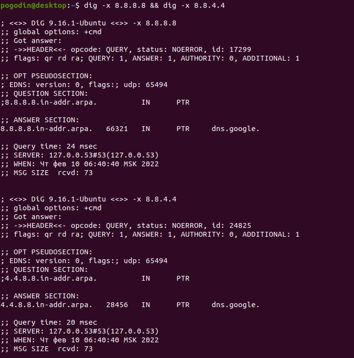

# Домашнее задание к занятию "3.6. Компьютерные сети, лекция 1"

1. Работа c HTTP через телнет.

   * Подключитесь утилитой телнет к сайту `stackoverflow.com` `telnet stackoverflow.com 80`

   * отправьте HTTP запрос

```
GET /questions HTTP/1.0
HOST: stackoverflow.com
[press enter]
[press enter]
```

   * В ответе укажите полученный HTTP код, что он означает?


```
   Код ответа - 301 (Moved Permanently) — стандартный код ответа HTTP, получаемый в ответ от сервера в ситуации, когда запрошенный ресурс был на постоянной основе перемещён в новое месторасположение, и указывающий на то, что текущие ссылки, использующие данный URL, должны быть обновлены.

   Адрес нового месторасположения ресурса - location: https://stackoverflow.com/questions
```

2. Повторите задание 1 в браузере, используя консоль разработчика F12.

   * откройте вкладку `Network`
   
   * отправьте запрос `http://stackoverflow.com`
   
   * найдите первый ответ HTTP сервера, откройте вкладку `Headers`
   
   * укажите в ответе полученный HTTP код.
   

   
   * проверьте время загрузки страницы, какой запрос обрабатывался дольше всего?
   
   * приложите скриншот консоли браузера в ответ.
   


3. Какой IP адрес у вас в интернете?


4. Какому провайдеру принадлежит ваш IP адрес? Какой автономной системе AS? Воспользуйтесь утилитой `whois`


5. Через какие сети проходит пакет, отправленный с вашего компьютера на адрес `8.8.8.8`? Через какие AS? Воспользуйтесь утилитой `traceroute`


6. Повторите задание 5 в утилите `mtr`. На каком участке наибольшая задержка - `delay`?



```
Задержек нет.
```

7. Какие DNS сервера отвечают за доменное имя `dns.google`? Какие A записи? воспользуйтесь утилитой `dig`





8. Проверьте PTR записи для IP адресов из задания 7. Какое доменное имя привязано к IP? воспользуйтесь утилитой `dig`



