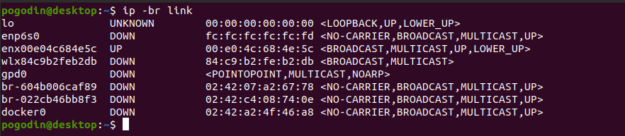

# Домашнее задание к занятию "3.7. Компьютерные сети, лекция 2"

1. Проверьте список доступных сетевых интерфейсов на вашем компьютере. Какие команды есть для этого в Linux и в Windows?



```
Linux: ip, ifconfig
Windows: ipconfig, netsh
```

2. Какой протокол используется для распознавания соседа по сетевому интерфейсу? Какой пакет и команды есть в Linux для этого?

```
Протокол: LLDP (Link Layer Discovery Protocol)
Пакет: lldpd
Команда: lldpctl
```

3. Какая технология используется для разделения L2 коммутатора на несколько виртуальных сетей? Какой пакет и команды есть в Linux для этого? Приведите пример конфига.

```
Технология: VLAN (Virtual Local Area Network)
Пакет: vlan
Создание командой ip:
   ip link add link eth0 name eth0.10 type vlan id 10
   ip addr add 192.168.1.200/24 brd 192.168.1.255 dev eth0.10
   ip link set dev eth0.10 up
Конфигурация в /etc/network/interfaces
   auto enp1s0.100
   iface enp1s0.100 inet static
   address 192.168.100.2
   netmask 255.255.255.0
   vlan-raw-device enp1s0.100
```

4. Какие типы агрегации интерфейсов есть в Linux? Какие опции есть для балансировки нагрузки? Приведите пример конфига.

```
В Linux используется LAG(link aggregation).
 
Опции балансировки:
mode=0 (balance-rr)
Этот режим используется по-умолчанию, если в настройках не указано другое. balance-rr обеспечивает балансировку  
нагрузки и отказоустойчивость. В данном режиме пакеты отправляются "по кругу" от первого интерфейса к последнему  
и сначала. Если выходит из строя один из интерфейсов, пакеты отправляются на остальные оставшиеся.При  
подключении портов к разным коммутаторам, требует их настройки.

mode=1 (active-backup)
При active-backup один интерфейс работает в активном режиме, остальные в ожидающем. Если активный падает,  
управление передается одному из ожидающих. Не требует поддержки данной функциональности от коммутатора.

mode=2 (balance-xor)
Передача пакетов распределяется между объединенными интерфейсами по формуле ((MAC-адрес источника) XOR (MAC-адрес  
получателя)) % число интерфейсов. Один и тот же интерфейс работает с определённым получателем. Режим даёт  
балансировку нагрузки и отказоустойчивость.

mode=3 (broadcast)
Происходит передача во все объединенные интерфейсы, обеспечивая отказоустойчивость.

mode=4 (802.3ad)
Это динамическое объединение портов. В данном режиме можно получить значительное увеличение пропускной способности  
как входящего так и исходящего трафика, используя все объединенные интерфейсы. Требует поддержки режима от  
коммутатора, а так же (иногда) дополнительную настройку коммутатора.

mode=5 (balance-tlb)
Адаптивная балансировка нагрузки. При balance-tlb входящий трафик получается только активным интерфейсом,  
исходящий - распределяется в зависимости от текущей загрузки каждого интерфейса. Обеспечивается отказоустойчивость  
и распределение нагрузки исходящего трафика. Не требует специальной поддержки коммутатора.

mode=6 (balance-alb)
Адаптивная балансировка нагрузки (более совершенная). Обеспечивает балансировку нагрузки как исходящего (TLB,  
transmit load balancing), так и входящего трафика (для IPv4 через ARP). Не требует специальной поддержки   
коммутатором, но требует возможности изменять MAC-адрес устройства.

Конфиг /etc/network/interafaces:

auto eth0
iface eth0 inet manual
 
auto eth1
iface eth1 inet manual
 
auto bond0
iface bond0 inet static
	address 10.0.2.15/24
	gateway 10.0.2.1
	dns-nameservers 10.10.10.10 10.10.10.11
	slaves eth0 eth1
	bond-mode active-backup
	bond-miimon 100
	bond-downdelay 200
	bond-updelay 200
```

5. Сколько IP адресов в сети с маской /29 ? Сколько /29 подсетей можно получить из сети с маской /24. Приведите несколько примеров /29 подсетей внутри сети 10.10.10.0/24.


```
Внутри сети 10.10.10.0/24 содержатся 32 подсети с маской /29:
10.10.10.0/29 
10.10.10.8/29
10.10.10.16/29
10.10.10.24/29
...
10.10.10.240/29
10.10.10.248/29
```

6. Задача: вас попросили организовать стык между 2-мя организациями. Диапазоны 10.0.0.0/8, 172.16.0.0/12, 192.168.0.0/16 уже заняты. Из какой подсети допустимо взять частные IP адреса? Маску выберите из расчета максимум 40-50 хостов внутри подсети.

```
Подсеть 100.64.0.0/10
```


7. Как проверить ARP таблицу в Linux, Windows? Как очистить ARP кеш полностью? Как из ARP таблицы удалить только один нужный IP?


```
очистить ARP кеш: ip neigh flush all

удалить IP: arp -d 192.168.40.2
```
