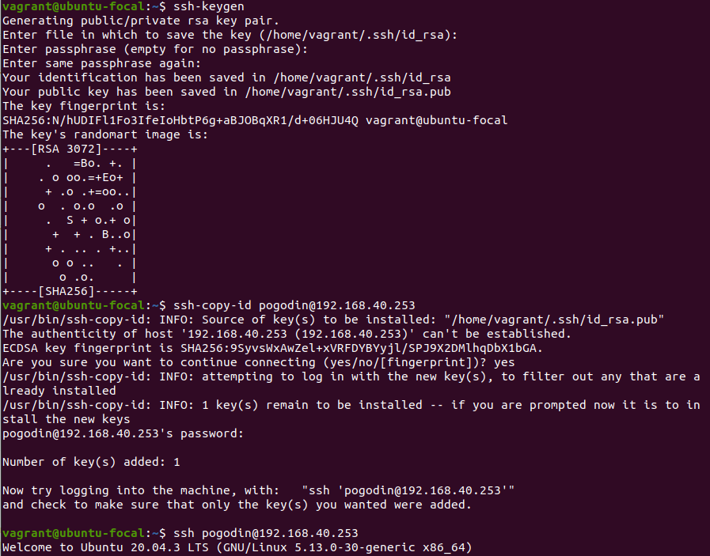

# Домашнее задание к занятию "3.9. Элементы безопасности информационных систем"

1. Установите `Bitwarden` плагин для браузера. Зарегестрируйтесь и сохраните несколько паролей.

2. Установите `Google authenticator` на мобильный телефон. Настройте вход в `Bitwarden` акаунт через `Google authenticator OTP`.


3. Установите `apache2`, сгенерируйте самоподписанный сертификат, настройте тестовый сайт для работы по `HTTPS`.


4. Проверьте на `TLS` уязвимости произвольный сайт в интернете (кроме сайтов МВД, ФСБ, МинОбр, НацБанк, РосКосмос, РосАтом, РосНАНО и любых госкомпаний, объектов КИИ, ВПК ... и тому подобное).


5. Установите на `Ubuntu ssh` сервер, сгенерируйте новый приватный ключ. Скопируйте свой публичный ключ на другой сервер. Подключитесь к серверу по `SSH`-ключу.



6. Переименуйте файлы ключей из задания 5. Настройте файл конфигурации `SSH` клиента, так чтобы вход на удаленный сервер осуществлялся по имени сервера.


7. Соберите дамп трафика утилитой `tcpdump` в формате `pcap`, 100 пакетов. Откройте файл `pcap` в `Wireshark`.


## Задание для самостоятельной отработки

8*. Просканируйте хост `scanme.nmap.org`. Какие сервисы запущены?


```
22 - стандартный ssh
80 - http
9929 - nping-echo (функция устранения неполадок в сети, которая использует сервер и клиент, которые обмениваются   
данными друг с другом по побочному TCP-каналу, одновременно отправляя тестовый трафик друг другу.
31337 - TCP-порт, использовавшейся известной троянской программой Back Orifice (шутка-юмора)
```

9*. Установите и настройте фаервол `ufw` на web-сервер из задания 3. Откройте доступ снаружи только к портам `22`,`80`,`443`


