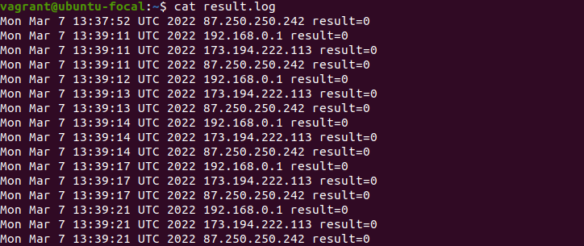

# Домашнее задание к занятию "4.1. Командная оболочка Bash: Практические навыки"

## Обязательная задача 1

Есть скрипт:
```bash
a=1
b=2
c=a+b
d=$a+$b
e=$(($a+$b))
```

Какие значения переменным c,d,e будут присвоены? Почему?


| Переменная | Значение | Обоснование                                                  |
| ---------- | -------- | -------------------------------------------------------------|
| `c`        | a+b      | передали строковое значение                                  |
| `d`        | 1+2      | подставили значения переменных в строку                      |
| `e`        | 3        | вычислили значение переменных a и b, передали в переменную e |


## Обязательная задача 2
На нашем локальном сервере упал сервис и мы написали скрипт, который постоянно проверяет его доступность, записывая дату проверок до тех пор, пока сервис не станет доступным (после чего скрипт должен завершиться). В скрипте допущена ошибка, из-за которой выполнение не может завершиться, при этом место на Жёстком Диске постоянно уменьшается. Что необходимо сделать, чтобы его исправить:

```bash
while ((1==1)                           #отстутствует вторая скобка
do
	curl https://localhost:4757
	if (($? != 0))
	then
		date >> curl.log         #запись в конец файла
	fi                               #отстутствует выход из цикла
done
```

### Ваш скрипт:
```bash
#!/usr/bin/env bash

while ((1==1))
do
  curl https://localhost:4757
  if (($? != 0))
  then
    date > curl.log
  else 
    break
  fi
done
```


## Обязательная задача 3
Необходимо написать скрипт, который проверяет доступность трёх IP: `192.168.0.1`, `173.194.222.113`, `87.250.250.242` по `80` порту и записывает результат в файл `log`. Проверять доступность необходимо пять раз для каждого узла.

### Ваш скрипт:
```bash
#!/usr/bin/env bash

hosts=(192.168.0.1 173.194.222.113 87.250.250.242)
for i in {1..5}
do
  for host in ${hosts[@]}
  do
    curl $host:80 > /dev/null
    echo `date` $host result=$? >> result.log
  done
done
```



## Обязательная задача 4
Необходимо дописать скрипт из предыдущего задания так, чтобы он выполнялся до тех пор, пока один из узлов не окажется недоступным. Если любой из узлов недоступен - IP этого узла пишется в файл error, скрипт прерывается.

### Ваш скрипт:
```bash
#!/usr/bin/env bash

hosts=(192.168.0.1 173.194.222.113 87.250.250.24)
while ((1 == 1))
do
  for host in ${hosts[@]}
  do
    curl $host:80 > /dev/null
    if (($? == 0))
    then
      echo `date` $host result=$? >> result.log
    else
      echo $host - `date` >> error.log
      exit 1
    fi
  done
done
```

