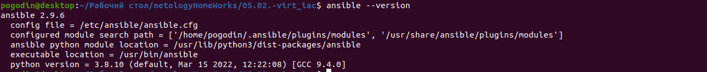
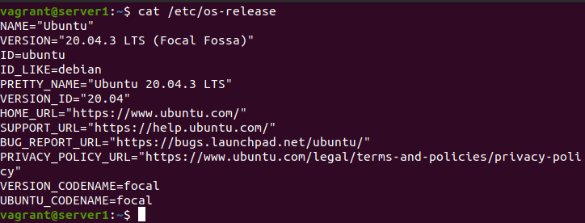
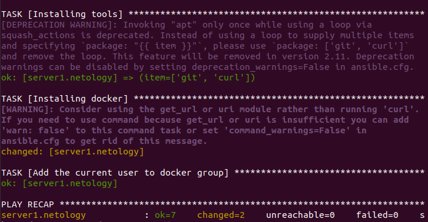
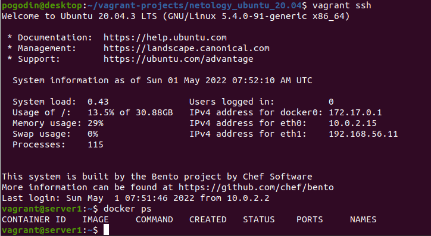

# Домашнее задание к занятию "5.2. Применение принципов IaaC в работе с виртуальными машинами"

## Задача 1

- Опишите своими словами основные преимущества применения на практике IaaC паттернов.

```
Скорость развертывания инфраструктуры и уменьшение рисков за счет минимизации селовеческих ошибок.
```
- Какой из принципов IaaC является основополагающим?

```
Идемпотентность - операция приведения системы в необходимое конечное состояние при первом и всех 
повторных применениях этой операции.
```

## Задача 2

- Чем Ansible выгодно отличается от других систем управление конфигурациями?

```
Отсутствие агентов, работа по протоколу SSH, декларативная модель - приводим систему в необходимое
 нам состояние.
```

- Какой, на ваш взгляд, метод работы систем конфигурации более надёжный push или pull?

```
Нет серебрянной пули, в каких-то случаях удобны системы с push моделью, когда конфигурацию рассылает 
управляющий сервер (на небольшом количестве кончных хостов), в других - pull-модель, когда хосты сами
 забирают свою конфигурацию с управляющего сервера (удобно, когда много хостов и можно получить проблемы 
с сетью).
```

## Задача 3

Установить на личный компьютер:

- VirtualBox
- Vagrant
- Ansible





## Задача 4 (*)

Воспроизвести практическую часть лекции самостоятельно.

- Создать виртуальную машину.
- Зайти внутрь ВМ, убедиться, что Docker установлен с помощью команды
```
docker ps
```







