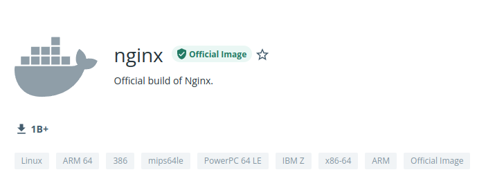
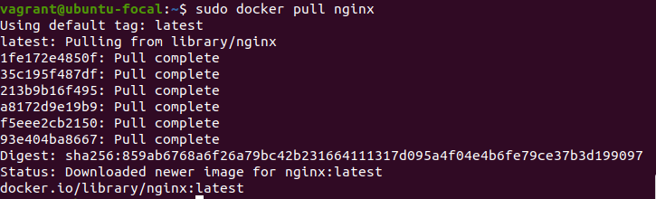
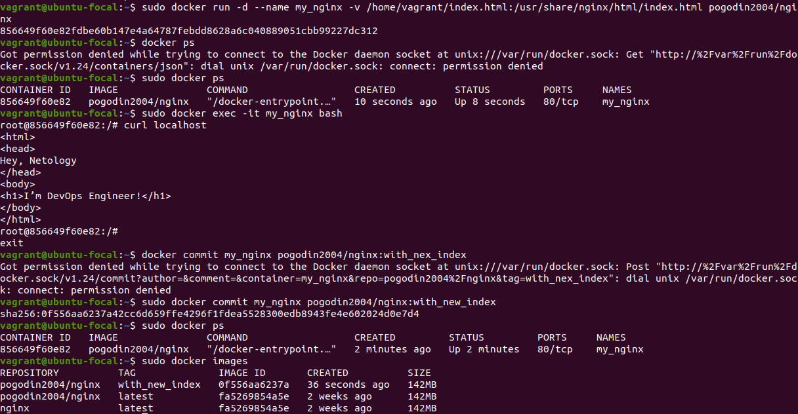
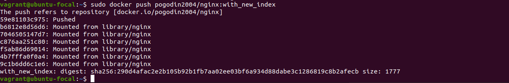
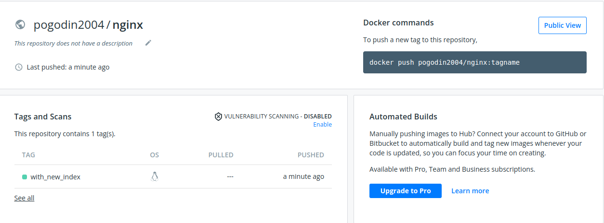
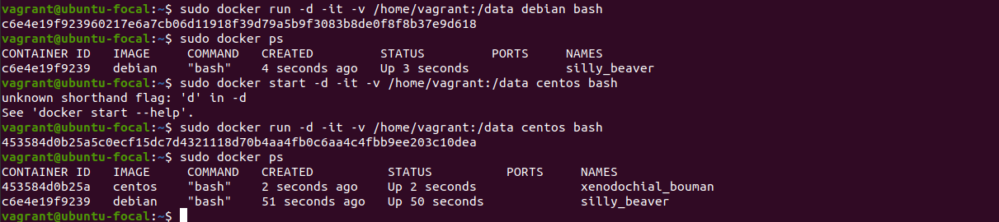
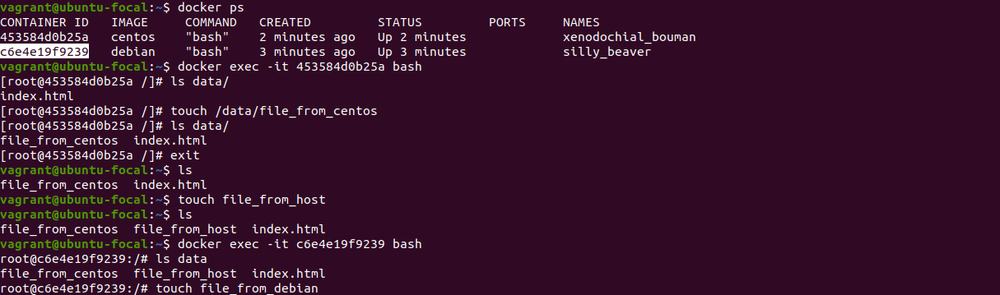
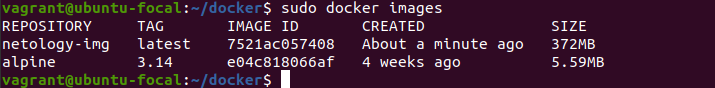
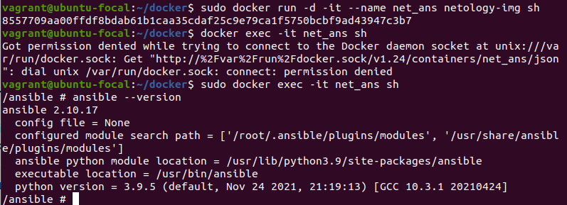
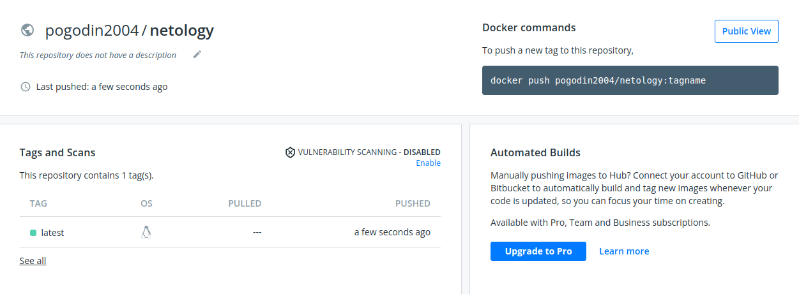

# Домашнее задание к занятию "5.3. Введение. Экосистема. Архитектура. Жизненный цикл Docker контейнера"

## Задача 1

Сценарий выполения задачи:

- создайте свой репозиторий на https://hub.docker.com;


- выберете любой образ, который содержит веб-сервер Nginx;



- создайте свой fork образа;



- реализуйте функциональность:
запуск веб-сервера в фоне с индекс-страницей, содержащей HTML-код ниже:
```
<html>
<head>
Hey, Netology
</head>
<body>
<h1>I’m DevOps Engineer!</h1>
</body>
</html>
```


Опубликуйте созданный форк в своем репозитории и предоставьте ответ в виде ссылки на https://hub.docker.com/username_repo.





[]()https://hub.docker.com/repository/docker/pogodin2004/nginx

## Задача 2

Посмотрите на сценарий ниже и ответьте на вопрос:
"Подходит ли в этом сценарии использование Docker контейнеров или лучше подойдет виртуальная машина, физическая машина? Может быть возможны разные варианты?"

Детально опишите и обоснуйте свой выбор.

Сценарий:

- Высоконагруженное монолитное java веб-приложение;
```
Здесь необходимо использовать физический сервер, т.к. приложение монолитное и плохо стыкуется с концепцией 
 контейнеров - "одна задача - один контейнер", а так как приложение еще и высоконагруженное, то виртуализация
 тоже слпбо подходит.
```
- Nodejs веб-приложение;
```
В данном случае оправдано применение контейнеров, можно собрать все зависимости и при необходимости легко 
масштабировать приложение.
```
- Мобильное приложение c версиями для Android и iOS;
```
Разные архитектуры устройств - нужно использовать виртуальные машины.
```
- Шина данных на базе Apache Kafka;
```
Контейнеры - можно быстро горизонтально масштабироваться.
```
- Elasticsearch кластер для реализации логирования продуктивного веб-приложения - три ноды elasticsearch, два logstash и две ноды kibana;
```
Можно использовать контейнеры. Это стандартный стек логгирования - можно легко масштабировать.
```
- Мониторинг-стек на базе Prometheus и Grafana;
```
Контейнеры - стандартный нобор мониторинга с официальными образами, поднимающимися с помощью compose.
```
- MongoDB, как основное хранилище данных для java-приложения;
```
Наверное лучше использовать физические сервера или виртуализацию, т.к. здесь привязка базы данных и 
java-приложения. Много I/O операций и тяжелое приложение, требовательное к ресурсам.
```
- Gitlab сервер для реализации CI/CD процессов и приватный (закрытый) Docker Registry.
```
Контейнеры - есть официальные образы, можно быстро и удобно поднять свою инфраструктурую
```

## Задача 3

- Запустите первый контейнер из образа ***centos*** c любым тэгом в фоновом режиме, подключив папку ```/data``` из текущей рабочей директории на хостовой машине в ```/data``` контейнера;
- Запустите второй контейнер из образа ***debian*** в фоновом режиме, подключив папку ```/data``` из текущей рабочей директории на хостовой машине в ```/data``` контейнера;
- Подключитесь к первому контейнеру с помощью ```docker exec``` и создайте текстовый файл любого содержания в ```/data```;
- Добавьте еще один файл в папку ```/data``` на хостовой машине;
- Подключитесь во второй контейнер и отобразите листинг и содержание файлов в ```/data``` контейнера.





## Задача 4 (*)

Воспроизвести практическую часть лекции самостоятельно.

Соберите Docker образ с Ansible, загрузите на Docker Hub и пришлите ссылку вместе с остальными ответами к задачам.







[]()https://hub.docker.com/repository/docker/pogodin2004/netology


