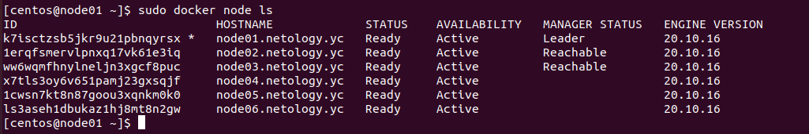
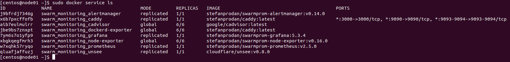
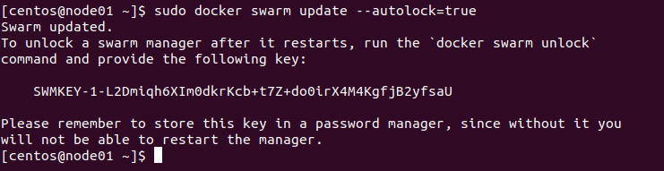

# Домашнее задание к занятию "5.5. Оркестрация кластером Docker контейнеров на примере Docker Swarm"

## Задача 1

Дайте письменые ответы на следующие вопросы:

- В чём отличие режимов работы сервисов в Docker Swarm кластере: replication и global?

```
Режим global - контейнеры запускаются на всех нодах кластера (агенты систем мониторинга и т.д), а в режиме 
replication - только на том количестве нод, которое указано в опции --replicas.
```

- Какой алгоритм выбора лидера используется в Docker Swarm кластере?

```
RAFT - протокол для реализации распределённого консенсуса. В случае сбоя любой manager-узел может взять на себя задачи 
и восстановить службы в стабильном состоянии. Например, если leader-нода, отвечающая за планирование задач в кластере, 
выходит из строя, любая другая manager-нода может взять на себя задачу планирования и повторной балансировки задач.
```

- Что такое Overlay Network?

```
Виртуальная сеть, работающая поверх физических сетей и связывающая контейнеры внутри кластера.
 Overlay сеть инкапсулирует L2 трафик в пакеты L4 и работает через UDP порт 4789
```

## Задача 2

Создать ваш первый Docker Swarm кластер в Яндекс.Облаке



## Задача 3

Создать ваш первый, готовый к боевой эксплуатации кластер мониторинга, состоящий из стека микросервисов.



## Задача 4 (*)

Выполнить на лидере Docker Swarm кластера команду (указанную ниже) и дать письменное описание её функционала, что она делает и зачем она нужна:
```
docker swarm update --autolock=true
```



```
Данная команда включает автоматическую блокировку manager-нод кластера, что позволяет защитить 
журналы RAFT на диске. 
При перезапуске кластера нужно будет вручную ввести ключ, сгенерированный при вводе данной команды.
```
