# Домашнее задание к занятию "6.2. SQL"

## Задача 1

Используя docker поднимите инстанс PostgreSQL (версию 12) c 2 volume, 
в который будут складываться данные БД и бэкапы.

Приведите получившуюся команду или docker-compose манифест.

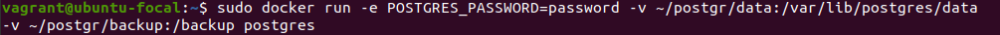


## Задача 2

В БД из задачи 1: 
- создайте пользователя test-admin-user и БД test_db

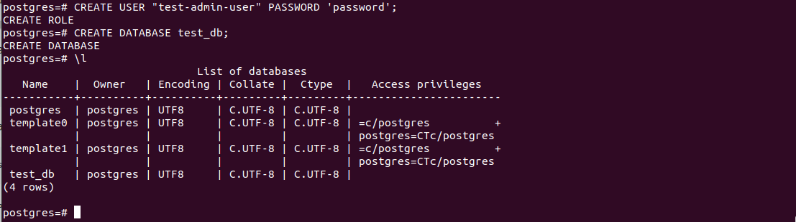

- в БД test_db создайте таблицу orders и clients (спeцификация таблиц ниже)

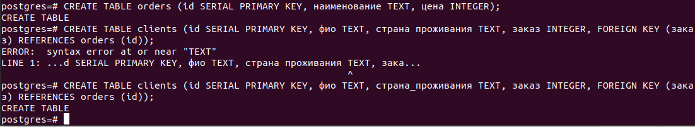


- предоставьте привилегии на все операции пользователю test-admin-user на таблицы БД test_db

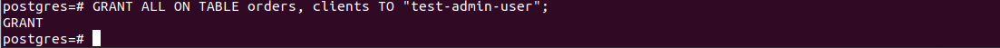

- создайте пользователя test-simple-user 

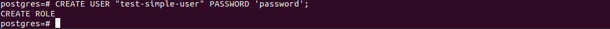

- предоставьте пользователю test-simple-user права на SELECT/INSERT/UPDATE/DELETE данных таблиц БД test_db


Таблица orders:
- id (serial primary key)
- наименование (string)
- цена (integer)

Таблица clients:
- id (serial primary key)
- фамилия (string)
- страна проживания (string, index)
- заказ (foreign key orders)

Приведите:
- итоговый список БД после выполнения пунктов выше,

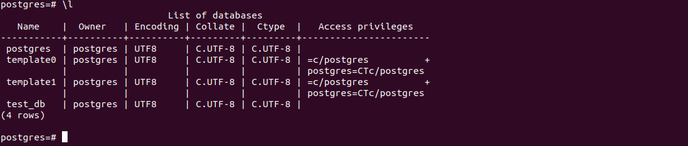

- описание таблиц (describe)

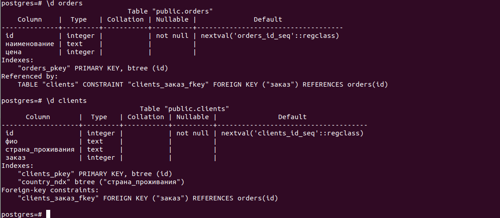

- SQL-запрос для выдачи списка пользователей с правами над таблицами test_db

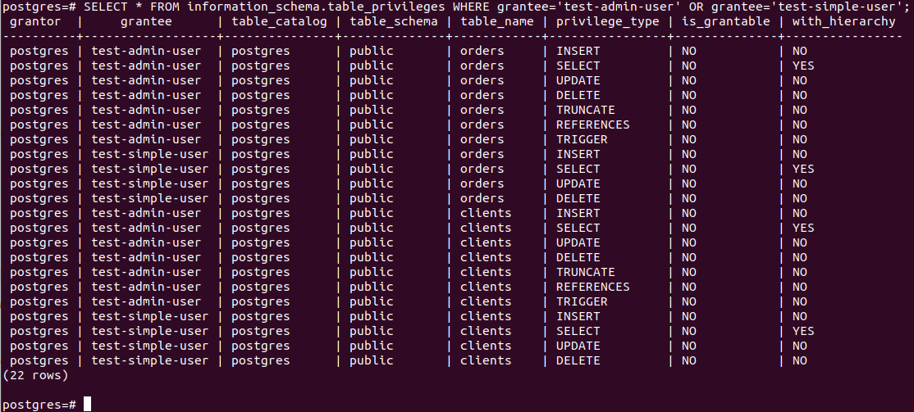

- список пользователей с правами над таблицами test_db

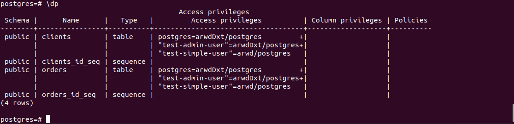

## Задача 3

Используя SQL синтаксис - наполните таблицы следующими тестовыми данными:

Таблица orders

|Наименование|цена|
|------------|----|
|Шоколад| 10 |
|Принтер| 3000 |
|Книга| 500 |
|Монитор| 7000|
|Гитара| 4000|

Таблица clients

|ФИО|Страна проживания|
|------------|----|
|Иванов Иван Иванович| USA |
|Петров Петр Петрович| Canada |
|Иоганн Себастьян Бах| Japan |
|Ронни Джеймс Дио| Russia|
|Ritchie Blackmore| Russia|

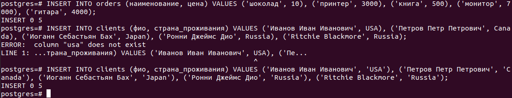

Используя SQL синтаксис:
- вычислите количество записей для каждой таблицы 
- приведите в ответе:
    - запросы 
    - результаты их выполнения.

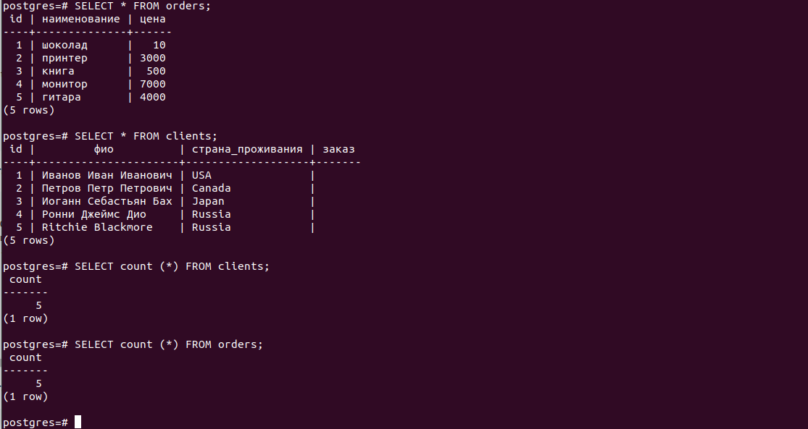

## Задача 4

Часть пользователей из таблицы clients решили оформить заказы из таблицы orders.

Используя foreign keys свяжите записи из таблиц, согласно таблице:

|ФИО|Заказ|
|------------|----|
|Иванов Иван Иванович| Книга |
|Петров Петр Петрович| Монитор |
|Иоганн Себастьян Бах| Гитара |

Приведите SQL-запросы для выполнения данных операций.


Приведите SQL-запрос для выдачи всех пользователей, которые совершили заказ, а также вывод данного запроса.


## Задача 5

Получите полную информацию по выполнению запроса выдачи всех пользователей из задачи 4 
(используя директиву EXPLAIN).

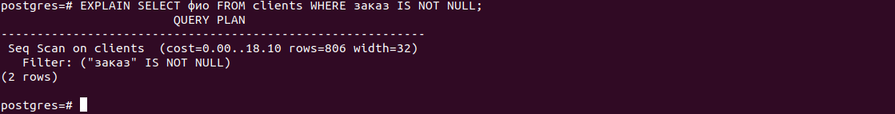

Приведите получившийся результат и объясните что значат полученные значения.

```
cost - стоимость запроса зависит от того, сколько времени и ресурсов ЦП потребуется для выполнения запроса. 
Это оценочное значение, так как запрос может занять меньше или больше времени в зависимости от данных.
rows - предполагаемое количество строк, выводимых этим узлом.
width - расчетная средняя ширина строк, выводимых этим узлом.
filter - применение фильтрации с условием.
```

## Задача 6

Создайте бэкап БД test_db и поместите его в volume, предназначенный для бэкапов (см. Задачу 1).

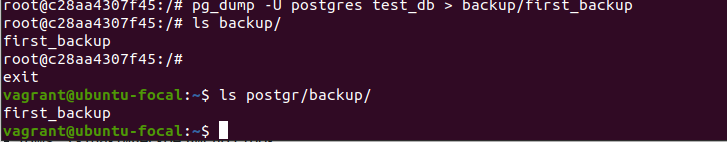

Остановите контейнер с PostgreSQL (но не удаляйте volumes).

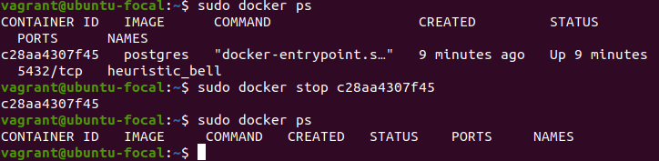

Поднимите новый пустой контейнер с PostgreSQL.

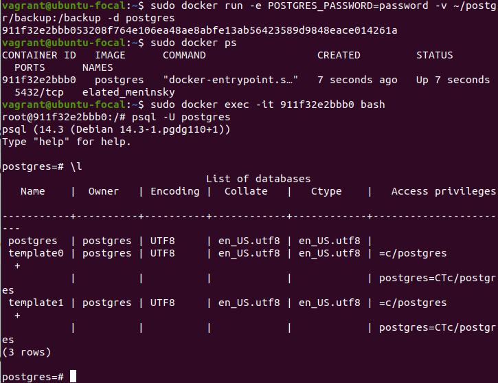

Восстановите БД test_db в новом контейнере.


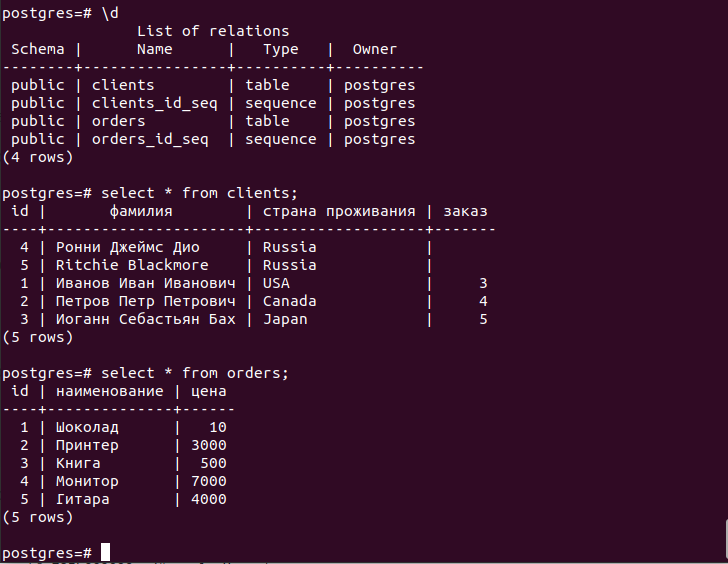

