# Домашнее задание к занятию "6.4. PostgreSQL"

## Задача 1

Используя docker поднимите инстанс PostgreSQL (версию 13). Данные БД сохраните в volume.

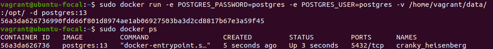

Подключитесь к БД PostgreSQL используя `psql`.

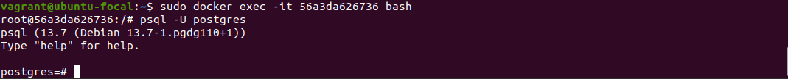

Воспользуйтесь командой `\?` для вывода подсказки по имеющимся в `psql` управляющим командам.

**Найдите и приведите** управляющие команды для:
- вывода списка БД

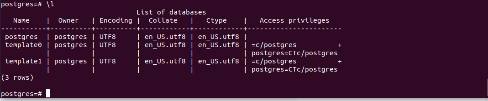

- подключения к БД

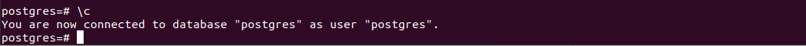

- вывода списка таблиц

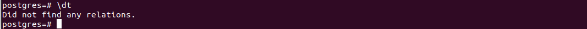

- вывода описания содержимого таблиц

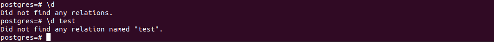

- выхода из psql


## Задача 2

Используя `psql` создайте БД `test_database`.

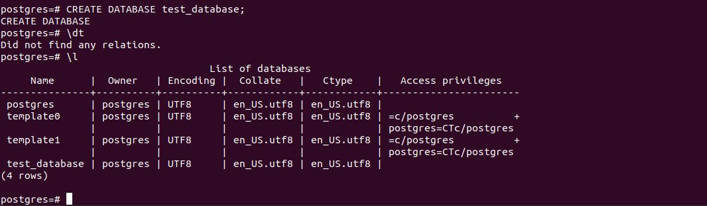

Восстановите бэкап БД в `test_database`.

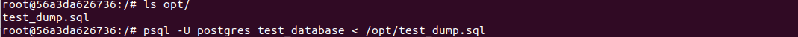

Перейдите в управляющую консоль `psql` внутри контейнера.

Подключитесь к восстановленной БД и проведите операцию ANALYZE для сбора статистики по таблице.

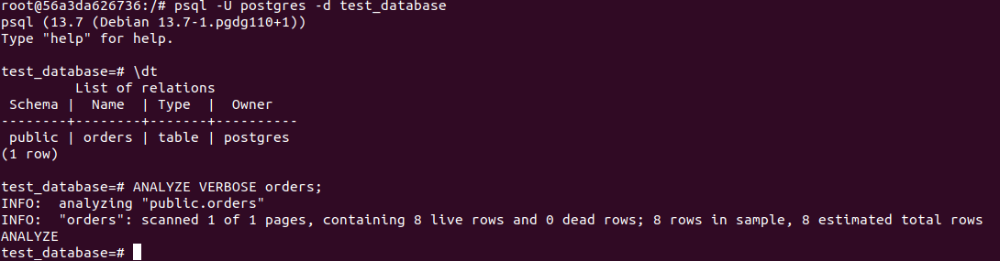

Используя таблицу `pg_stats`, найдите столбец таблицы `orders` с наибольшим средним значением 
размера элементов в байтах.

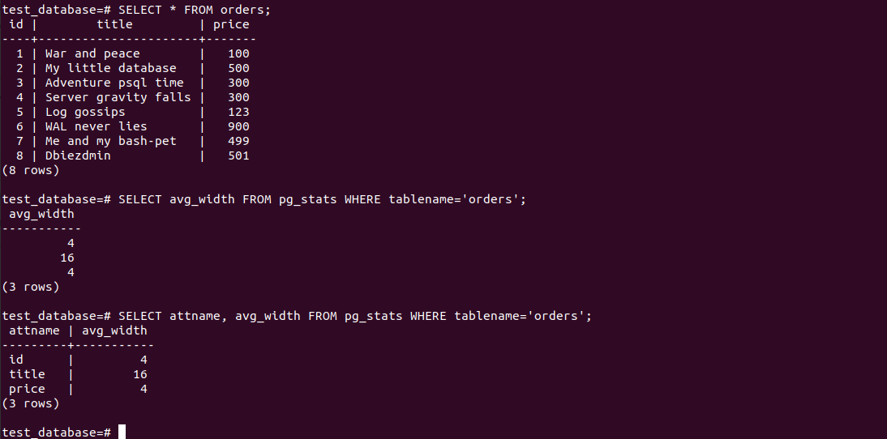


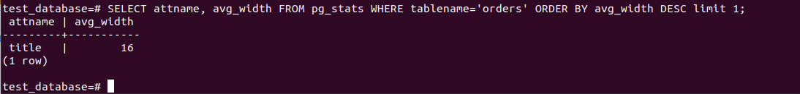

## Задача 3

Архитектор и администратор БД выяснили, что ваша таблица orders разрослась до невиданных размеров и
поиск по ней занимает долгое время. Вам, как успешному выпускнику курсов DevOps в нетологии предложили
провести разбиение таблицы на 2 (шардировать на orders_1 - price>499 и orders_2 - price<=499).

Предложите SQL-транзакцию для проведения данной операции.

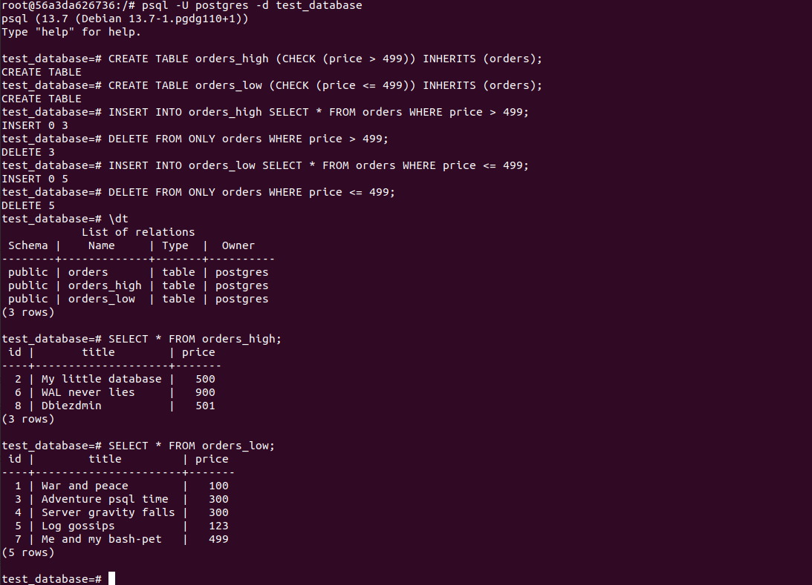

Можно ли было изначально исключить "ручное" разбиение при проектировании таблицы orders?

```
Если изначально рассмотривался рост таблицы, то на этапе проектирования можно было бы создать 
критерии разделения записей в разные таблицы.
```

## Задача 4

Используя утилиту `pg_dump` создайте бекап БД `test_database`.

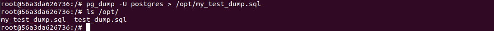

Как бы вы доработали бэкап-файл, чтобы добавить уникальность значения столбца `title` для таблиц `test_database`?

```
Можно добавить UNIQUE в файле дампа при создании таблицы orders для столбца title
```

