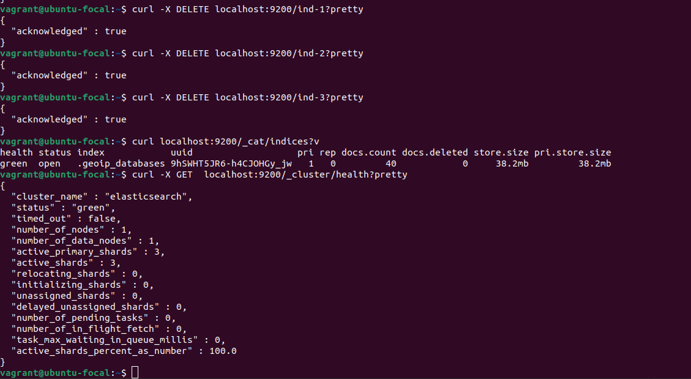

# Домашнее задание к занятию "6.5. Elasticsearch"

## Задача 1

Используя докер образ `centos:7`

- составьте Dockerfile-манифест для elasticsearch
- соберите docker-образ и сделайте `push` в ваш docker.io репозиторий
- запустите контейнер из получившегося образа и выполните запрос пути `/` c хост-машины

Требования к `elasticsearch.yml`:
- данные `path` должны сохраняться в `/var/lib`
- имя ноды должно быть `netology_test`

В ответе приведите:
- текст Dockerfile манифеста


- ссылку на образ в репозитории dockerhub


- ответ `elasticsearch` на запрос пути `/` в json виде


## Задача 2

Добавьте в `elasticsearch` 3 индекса, в соответствии со таблицей:

| Имя | Количество реплик | Количество шард |
|-----|-------------------|-----------------|
| ind-1| 0 | 1 |
| ind-2 | 1 | 2 |
| ind-3 | 2 | 4 |


Получите состояние кластера `elasticsearch`, используя API.


Как вы думаете, почему часть индексов и кластер находится в состоянии yellow?

```
У нас одна нода, а ind-2 и ind-3 имеют реплики, которые тоже расположены на ней, а по 
правильному - должны находиться на других нодах кластера.
```
Удалите все индексы.



## Задача 3

Создайте директорию `{путь до корневой директории с elasticsearch в образе}/snapshots`.


Используя API зарегистрируйте данную директорию как `snapshot repository` 
c именем `netology_backup`.


Создайте индекс `test` с 0 реплик и 1 шардом и **приведите в ответе** список индексов.


Создайте `snapshot` состояния кластера `elasticsearch`.


**Приведите в ответе** список файлов в директории со `snapshot`ами.


Удалите индекс `test` и создайте индекс `test-2`. 


Восстановите состояние кластера `elasticsearch` из `snapshot`, созданного ранее. 

**Приведите в ответе** запрос к API восстановления и итоговый список индексов.


