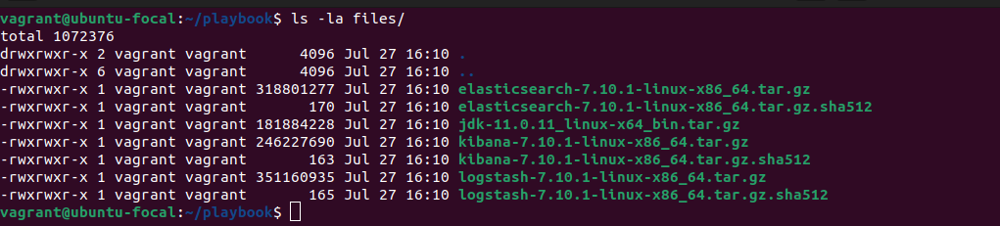
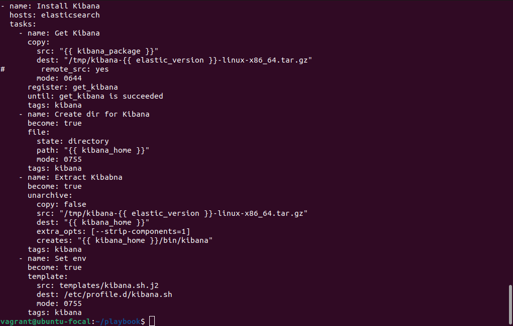
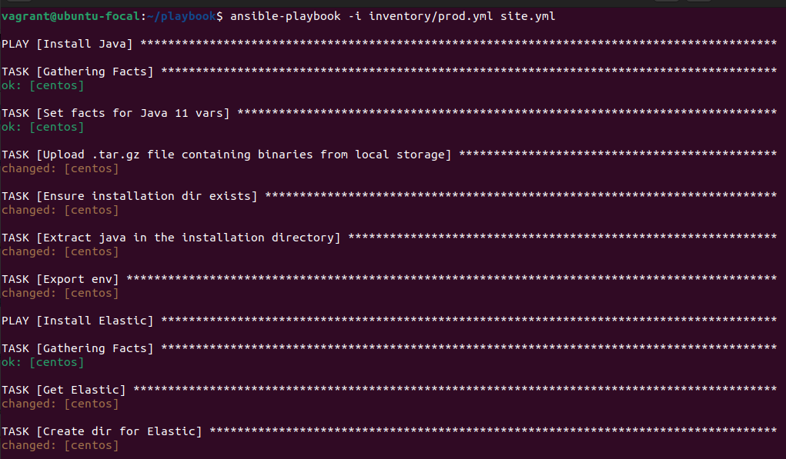
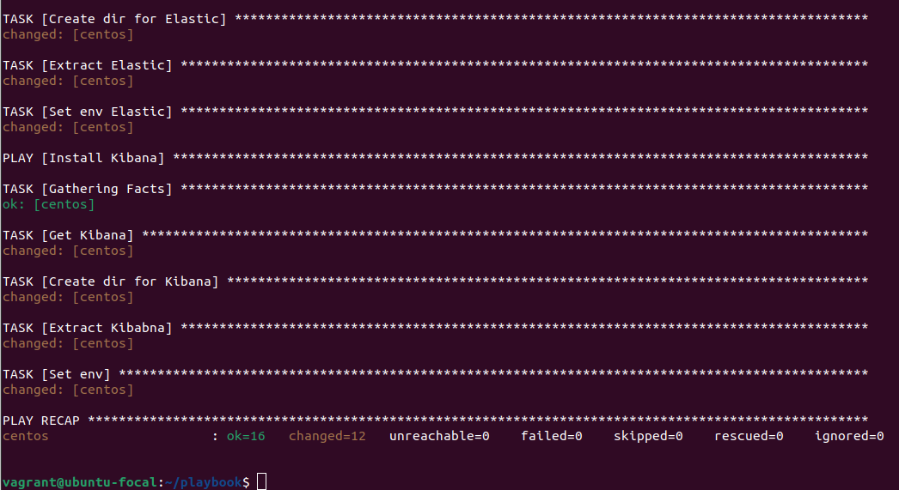

# Домашнее задание к занятию "08.02 Работа с Playbook"

## Подготовка к выполнению
1. Создайте свой собственный (или используйте старый) публичный репозиторий на github с произвольным именем.
2. Скачайте [playbook](./playbook/) из репозитория с домашним заданием и перенесите его в свой репозиторий.
3. Подготовьте хосты в соотвтествии с группами из предподготовленного playbook. 
4. Скачайте дистрибутив [java](https://www.oracle.com/java/technologies/javase-jdk11-downloads.html) и положите его в директорию `playbook/files/`. 

```
Свободно скачать дистрибутивы эластика и кибаны не получилось, поэтому воспользовался выложенными.
```



## Основная часть
1. Приготовьте свой собственный inventory файл `prod.yml`.


2. Допишите playbook: нужно сделать ещё один play, который устанавливает и настраивает kibana.






3. Готовый playbook выложите в свой репозиторий, в ответ предоставьте ссылку на него.

[Файлы](https://github.com/pogodin2004/netologyHomeWorks/tree/master/08.02.ansible_playbook/playbook)
