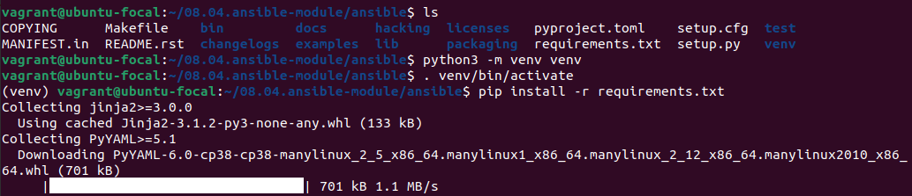
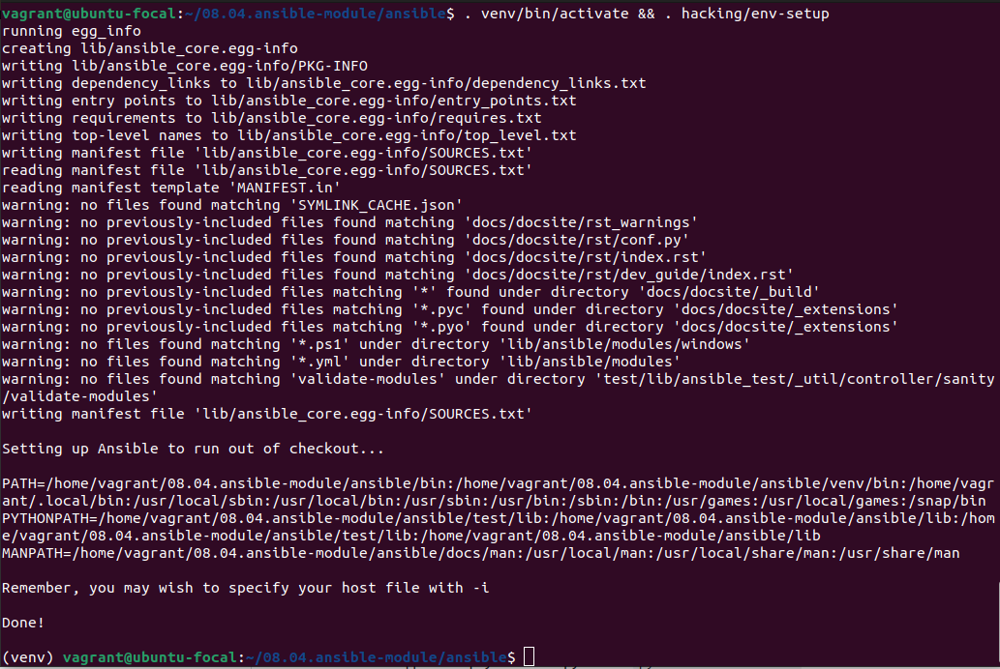
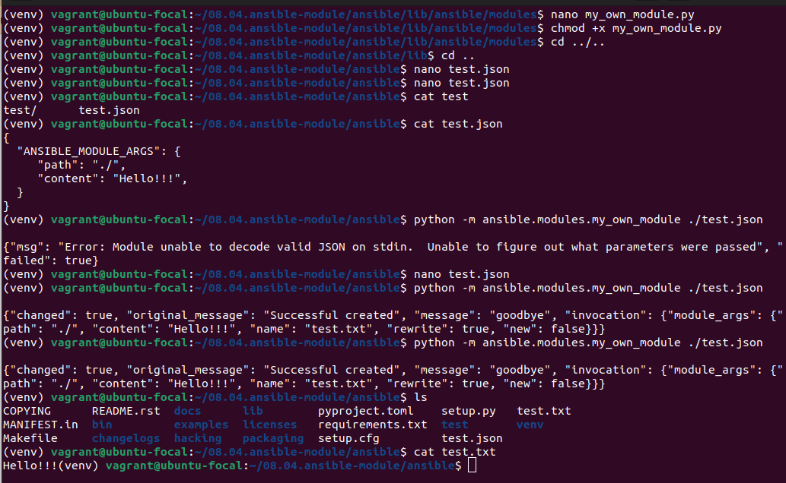
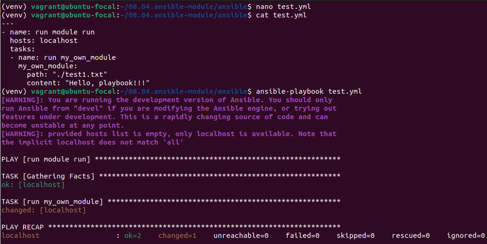
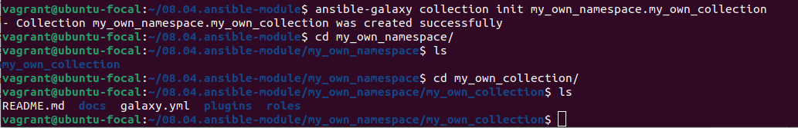

# Домашнее задание к занятию "08.04 Создание собственных modules"

## Подготовка к выполнению
1. Создайте пустой публичных репозиторий в любом своём проекте: `my_own_collection`
2. Скачайте репозиторий ansible: `git clone https://github.com/ansible/ansible.git` по любому удобному вам пути
3. Зайдите в директорию ansible: `cd ansible`
4. Создайте виртуальное окружение: `python3 -m venv venv`
5. Активируйте виртуальное окружение: `. venv/bin/activate`. Дальнейшие действия производятся только в виртуальном окружении
6. Установите зависимости `pip install -r requirements.txt`

7. Запустить настройку окружения `. hacking/env-setup`
8. Если все шаги прошли успешно - выйти из виртуального окружения `deactivate`
9. Ваше окружение настроено, для того чтобы запустить его, нужно находиться в директории `ansible` и выполнить конструкцию `. venv/bin/activate && . hacking/env-setup`

## Основная часть

Наша цель - написать собственный module, который мы можем использовать в своей role, через playbook. Всё это должно быть собрано в виде collection и отправлено в наш репозиторий.

1. В виртуальном окружении создать новый `my_own_module.py` файл
2. Наполнить его содержимым: из [статьи](https://docs.ansible.com/ansible/latest/dev_guide/developing_modules_general.html#creating-a-module)
3. Заполните файл в соответствии с требованиями ansible так, чтобы он выполнял основную задачу: module должен создавать текстовый файл на удалённом хосте по пути, определённом в параметре `path`, с содержимым, определённым в параметре `content`.
4. Проверьте module на исполняемость локально.

5. Напишите single task playbook и используйте module в нём.

6. Проверьте через playbook на идемпотентность.
7. Выйдите из виртуального окружения.
8. Инициализируйте новую collection: `ansible-galaxy collection init my_own_namespace.my_own_collection`

9. В данную collection перенесите свой module в соответствующую директорию.
10. Single task playbook преобразуйте в single task role и перенесите в collection. У role должны быть default всех параметров module
11. Создайте playbook для использования этой role.

///////////////////////////////////////////////////////////

12. Заполните всю документацию по collection, выложите в свой репозиторий, поставьте тег `1.0.0` на этот коммит.
13. Создайте .tar.gz этой collection: `ansible-galaxy collection build` в корневой директории collection.
14. Создайте ещё одну директорию любого наименования, перенесите туда single task playbook и архив c collection.
15. Установите collection из локального архива: `ansible-galaxy collection install <archivename>.tar.gz`
16. Запустите playbook, убедитесь, что он работает.
17. В ответ необходимо прислать ссылку на репозиторий с collection

[Файлы](https://github.com/pogodin2004/netologyHomeWorks/tree/master/08.02.ansible_playbook/playbook)
